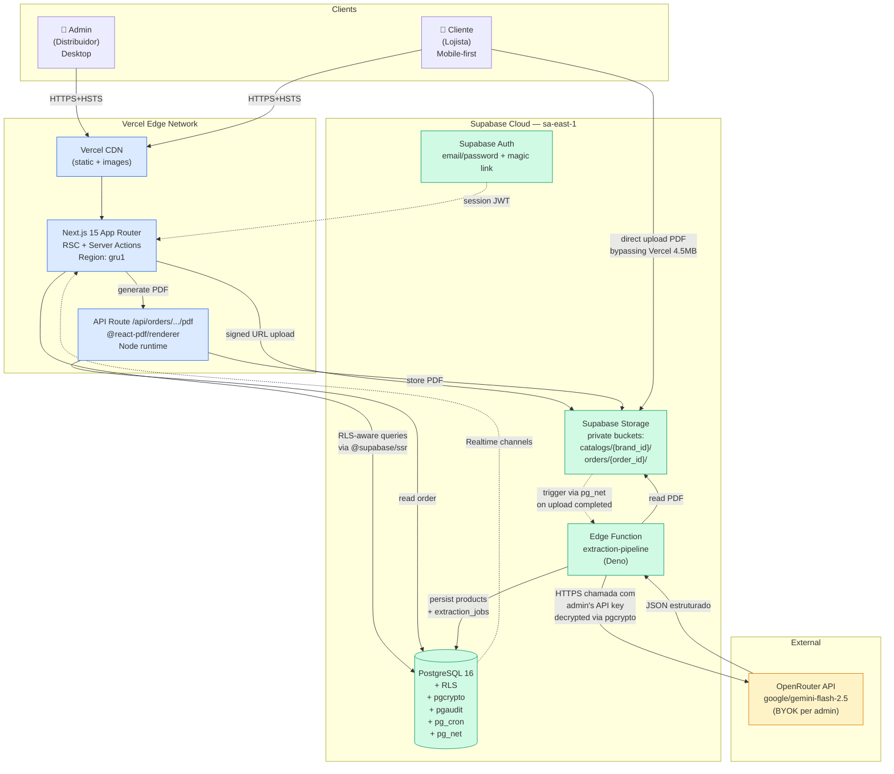
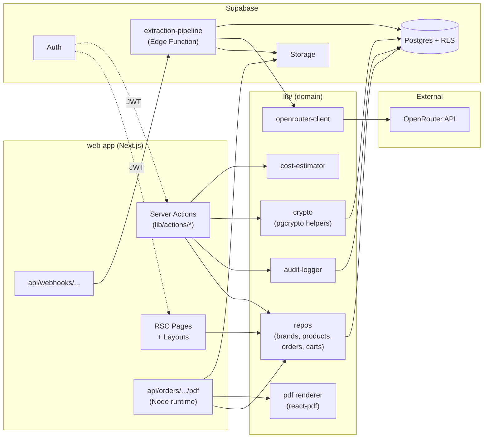
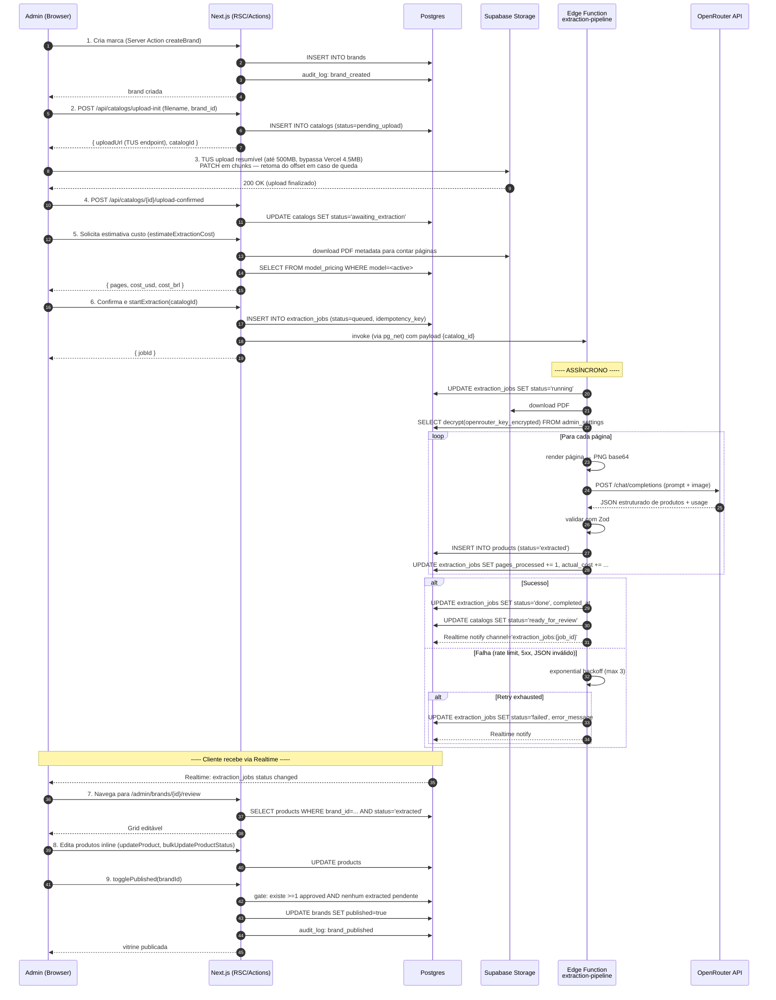
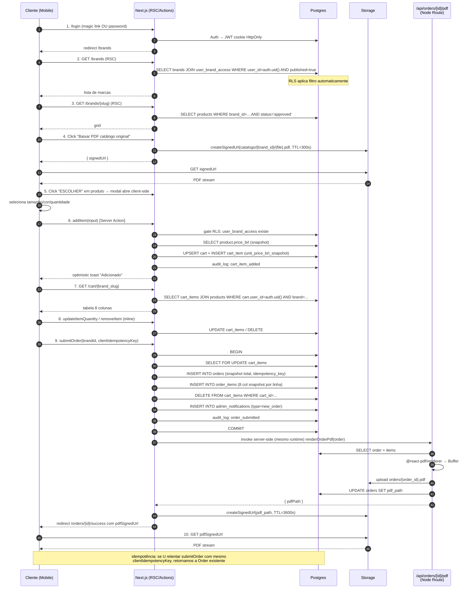
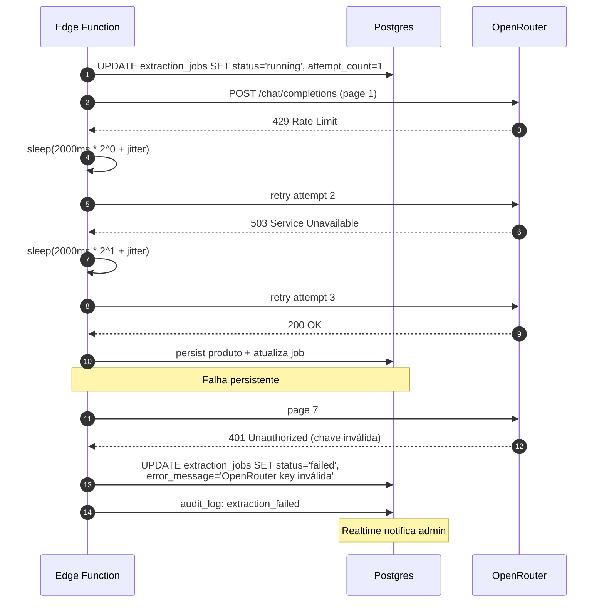

# CAMMES — Fullstack Architecture Document

> **Documento:** Fullstack Architecture Document
> **Projeto:** CAMMES — Catálogo Multimarcas com Extração Estruturada
> **Versão:** 1.0
> **Data:** 2026-05-19
> **Autor:** Aria (@architect)
> **Workflow:** greenfield-fullstack — Phase 3 (Architecture)
> **Insumos principais:** `docs/prd.md` (v1.1 — Morgan/@pm), `docs/brief.md` (v1.0 — Atlas/@analyst)
> **Próximo handoff:** @po (validação Phase 1) e @sm (criação de stories Phase 2)
> **Modo de execução:** YOLO autônomo

---

## 1. Introduction

Este documento define a arquitetura fullstack completa do **CAMMES — Catálogo Multimarcas com Extração Estruturada**, cobrindo o sistema de backend (Supabase + Edge Functions + Postgres + RLS), o frontend (Next.js 15+ App Router com React Server Components), o pipeline assíncrono de IA (OpenRouter BYOK com Gemini Flash 2.5), o pipeline de geração de PDF, a topologia de deploy (Vercel + Supabase Cloud) e os princípios transversais de segurança, performance, observabilidade e conformidade LGPD.

Este é o **single source of truth** para o desenvolvimento AI-driven do MVP. Toda decisão registrada aqui rastreia, por força do Article IV (No Invention) da AIOX Constitution, a pelo menos um FR-* / NFR-* do PRD v1.1 ou a uma decisão técnica documentada como ADR neste documento.

### 1.1 Starter Template or Existing Project

**Decisão:** **N/A — Greenfield project**. Não há starter template formal. O bootstrap é feito via `create-next-app` oficial com TypeScript estrito, App Router e Tailwind, complementado por instalação manual do shadcn/ui e da Supabase CLI.

[AUTO-DECISION] Adotar `create-next-app` oficial em vez de templates "Next.js + Supabase" de terceiros → razão: templates third-party (e.g., supabase-starter-template) frequentemente carregam opiniões obsoletas (e.g., Auth Helpers v0 deprecated em favor de `@supabase/ssr`), e o custo de remoção/atualização supera o custo de bootstrap manual de 4 dependências bem documentadas.

### 1.2 Change Log

| Date | Version | Description | Author |
|------|---------|-------------|--------|
| 2026-05-19 | 1.0 | Versão inicial do Fullstack Architecture Document a partir do PRD v1.1 | Aria (@architect) |

---

## 2. High Level Architecture

### 2.1 Technical Summary

CAMMES adota uma **arquitetura serverless híbrida monorepo-único** sobre **Next.js 15+ (App Router + React Server Components) na Vercel** e **Supabase Cloud (Postgres + Auth + Storage + Edge Functions)**, com integração externa **OpenRouter BYOK** (modelo padrão `google/gemini-flash-2.5`) para o pipeline de extração via LLM Vision. O frontend e a camada de Server Actions/API Routes vivem no mesmo repositório Next.js, comunicando-se via **Server Components (leitura tipada com RLS aplicado)** e **Server Actions (mutações com validação Zod)**, sem REST público dedicado. O isolamento entre marcas é garantido **inteiramente por Row-Level Security do Postgres** (não há barreira aplicacional substituindo RLS — RLS é a barreira), com `user_brand_access` como tabela-pivô. O pipeline assíncrono de extração roda em **Supabase Edge Functions (Deno)** disparadas por trigger `pg_net` após upload concluído, persistindo `extraction_jobs` em Postgres. O PDF de pedido é gerado server-side via **`@react-pdf/renderer`** em API Route Node.js. Esta arquitetura atende os goals do PRD (TMCV <60min, custo <R$ 50/catálogo, isolamento multitenant, FCP <2s) com complexidade operacional mínima e custo fixo inicial <R$ 250/mês (Vercel Pro + Supabase Pro), preservando uma trajetória clara para Turborepo (Phase 2 — gatilho documentado em ADR-001).

### 2.2 Platform and Infrastructure Choice

**Opções avaliadas:**

| Opção | Prós | Contras | Veredito |
|-------|------|---------|----------|
| **Vercel + Supabase** (escolhida) | Integração Next.js nativa; RLS Postgres maduro; auth+storage+functions unificados; signed URLs direto cliente→Storage bypassa limite 4.5MB Vercel; preço previsível Pro→Team; ecossistema de exemplos | Lock-in moderado; cold start Edge Functions Deno; cota Supabase Pro 500GB Storage exige planejamento | ESCOLHIDA |
| AWS (Lambda + RDS + Cognito + S3) | Escalabilidade máxima; flexibilidade total; sem lock-in PaaS | Complexidade operacional 5-10x; setup de RLS manual em Postgres autogerido; Cognito UX inferior a Supabase Auth; >2 semanas a mais de bootstrap | REJEITADA |
| Cloudflare (Pages + Workers + D1 + R2) | Edge global, custo baixíssimo; latência sub-50ms | D1 ainda em beta para produção crítica (2026-05); RLS em SQLite/D1 imatura; ecossistema Next.js menos polido | REJEITADA |

**Platform:** Vercel + Supabase Cloud
**Key Services:**
- **Vercel:** Hosting Next.js 15 (Edge + Node Runtime), Vercel CDN, Environment Variables, Preview Deployments por PR, GitHub integration nativa.
- **Supabase Cloud (Pro Plan, US-East-1 ou São Paulo conforme disponibilidade):** PostgreSQL 16 com RLS, Supabase Auth (email/senha + magic link), Supabase Storage (buckets privados por marca e por pedido), Supabase Edge Functions (Deno), `pg_cron`, `pg_net`, `pgcrypto`, `pgaudit`.
- **OpenRouter (externo):** Gateway LLM consumido por chave do admin (BYOK), modelo padrão `google/gemini-flash-2.5`.
- **GitHub Actions:** CI (lint, typecheck, test, build, RLS integration tests) + deploy via Vercel↔GitHub integration.

**Deployment Host and Regions:**
- Vercel: **edge global** (CDN automático); funções Node em região primária `gru1` (São Paulo) para reduzir latência ao Supabase.
- Supabase: **`sa-east-1` (São Paulo) preferencial**; fallback `us-east-1` se SP indisponível na conta — gatilho de re-provisionamento documentado em ADR-005 (Deployment Topology, abaixo).

[AUTO-DECISION] Região Supabase = São Paulo (`sa-east-1`) → razão: o universo dos usuários (distribuidores e lojistas) é 100% Brasil; co-localizar com Vercel `gru1` mantém RTT <30ms entre Next.js Server Components e Postgres, viável para NFR1 (FCP <2s) e NFR6 (mutações carrinho <500ms p95).

### 2.3 Repository Structure

**Structure:** Single Next.js repository (não-monorepo no MVP)
**Monorepo Tool:** N/A no MVP — Turborepo em Phase 2 (gatilho: introdução de pacote `@cammes/mobile` ou `@cammes/api-sdk` para integrações terceiras)
**Package Organization:** Estrutura interna por feature/domínio dentro de um único `package.json`. Pastas root:

```
.
├── app/                          # Next.js App Router (rotas + layouts)
├── components/                   # Componentes React reutilizáveis
├── lib/                          # Domínio: extração, carrinho, RLS helpers, OpenRouter client, crypto
├── supabase/
│   ├── migrations/               # SQL migrations versionadas
│   └── functions/                # Edge Functions Deno (extraction-pipeline, etc.)
├── tests/                        # Unit + Integration
├── public/
└── docs/
```

Justificativa formal em ADR-001 (Seção 17 abaixo).

### 2.4 High Level Architecture Diagram



### 2.5 Architectural Patterns

- **Serverless-First Fullstack:** Next.js + Supabase Edge Functions, sem servidores long-running gerenciados pela equipe. _Rationale:_ MVP com 1 dev fullstack; ops mínimas; escala automática até 100x sem mudança de código (NFR17 — disponibilidade ≥99.5%).
- **Server Components by Default:** Páginas e leituras são RSC; "use client" reservado a componentes com interação (modal ESCOLHER, edição inline, stepper de carrinho). _Rationale:_ Reduz bundle JS no cliente em ~40-60% vs SPA tradicional, suportando NFR1 (FCP <2s) e NFR3 (vitrine 100 produtos <3s em Slow 4G).
- **Server Actions for Mutations:** Mutações (criar marca, atualizar produto, addItem carrinho, enviar pedido) via Next.js Server Actions com validação Zod end-to-end. _Rationale:_ Elimina REST manual, garante type-safety FE↔BE sem geração de cliente, mantém crítico-de-RLS aplicado server-side.
- **RLS-as-Authorization (não como defesa-em-profundidade aplicacional):** Toda autorização cross-tenant é delegada ao Postgres via RLS — a aplicação **não** duplica checks de tenant. _Rationale:_ Single source of truth, impossível bypassar via bug aplicacional (FR36, NFR13). Trade-off: testes RLS são mandatórios e formais (Story 1.6, Story 2.5).
- **Repository Pattern (Lib-Level, leve):** `lib/products/repo.ts`, `lib/orders/repo.ts`, `lib/carts/repo.ts` encapsulam queries Supabase tipadas; Server Components e Server Actions consomem o repo, não o cliente Supabase diretamente. _Rationale:_ Permite mock em unit tests; troca futura de Postgres→outro armazenamento confinada a um arquivo por domínio.
- **Provider Pattern (LLM):** Interface `LLMExtractionProvider` com implementação inicial `OpenRouterProvider`. _Rationale:_ FR10, NFR20, R4 — troca de modelo/gateway sem refactor estrutural (ADR-003).
- **Strangler-Fig para Migração Monorepo:** Single-repo agora, Turborepo quando gatilho disparar; código atual já organizado em `lib/` por domínio para facilitar extração futura para `packages/*`. _Rationale:_ ADR-001.
- **Idempotência por Token de Negócio:** `extraction_jobs.idempotency_key = sha256(catalog_id + page_count + version)` e `orders.client_idempotency_key` (UUID v4 cliente). _Rationale:_ NFR18 (pipeline idempotente), evita pedidos duplicados em retry de envio.
- **Cache-Aside Server-Side com `unstable_cache`/Tags:** KPIs do dashboard admin (NFR para Story 5.4) e listagem de marcas para cliente em RSC, invalidados por tag em mutações relevantes. _Rationale:_ Query pesada de KPI cacheada 60s sem Redis externo.
- **Optimistic UI com Rollback:** Edição inline de produtos (Story 3.1) e quantidade de carrinho (Story 4.3) usam `useOptimistic` do React 19. _Rationale:_ UX fluida em 4G; NFR6 percebido como <500ms.
- **Audit-by-Default:** Todo Server Action crítico chama `logAuditEvent()` server-side antes de retornar sucesso. _Rationale:_ FR38, NFR16 (90 dias retenção), Story 5.5.

---

## 3. Tech Stack

> Esta tabela é a **fonte da verdade definitiva** para versões. Toda story DEVE usar exatamente estas versões. Atualizações exigem ADR de versionamento.

### 3.1 Technology Stack Table

| Category | Technology | Version | Purpose | Rationale |
|---|---|---|---|---|
| Frontend Language | TypeScript | 5.6.x | Linguagem única FE+BE+Edge | Strict mode (NFR29); shared types entre RSC e Edge Functions |
| Frontend Framework | Next.js | 15.0.x (App Router) | Framework fullstack | RSC + Server Actions; integração Vercel; ecossistema Tailwind/shadcn maduro (PRD 4.2) |
| React | React | 19.0.x | UI runtime | RSC estável; `useOptimistic`, `useFormState` para mutações fluidas |
| UI Component Library | shadcn/ui (Radix Primitives) | latest (registry copy) | Componentes acessíveis | WCAG AA out-of-the-box (NFR23-24); copy-paste, não dependência fechada (PRD 4.4) |
| Styling | Tailwind CSS | 3.4.x | Utility-first CSS | Padrão do PRD 4.4; integração shadcn |
| State Management (UI global) | Zustand | 4.5.x | Carrinho UI, toasts, drawer state | Lightweight (3KB), sem boilerplate; PRD 4.4 |
| Server State / Cache | TanStack Query | 5.59.x | Cache de dados client-side onde RSC não cobre (e.g., revisão inline) | PRD 4.4; integra com Server Actions via `useMutation` |
| Backend Language | TypeScript | 5.6.x | Server Actions + API Routes | Mesmo idioma do FE; tipo compartilhado |
| Edge Functions Language | TypeScript (Deno) | Deno 1.45+ | Pipeline de extração | Runtime Supabase Edge; npm compat para `pdfjs-dist` |
| API Style | Next.js Server Actions + minimal REST (API Routes) | — | Mutações (Actions); PDF download e webhooks (REST) | Sem GraphQL/tRPC para reduzir surface; Actions com Zod cobrem 95% dos casos |
| Database | PostgreSQL via Supabase | 16.x | Persistência principal + RLS | Decisão PRD 4.2; RLS maduro; `pgcrypto`, `pg_cron`, `pg_net`, `pgaudit`, `pgvector` (Phase 2) |
| ORM / Query Builder | Supabase JS Client (`@supabase/ssr` v0.5+, `@supabase/supabase-js` v2.45+) | 2.45.x | Acesso a Postgres com sessão | RLS aplicada via JWT do usuário; Server-side com `createServerClient` |
| Migrations | Supabase CLI | 1.200+ | Versionar schema | PRD 4.4 — `supabase migrations` em git |
| Cache (server-side ad-hoc) | Next.js `unstable_cache` + tag-based revalidation | — | KPIs dashboard, listagens | Sem Redis no MVP; suficiente para volume estimado |
| File Storage | Supabase Storage | — | PDFs originais (até 500MB, TUS resumível), recortes de produto, PDFs de pedido | Buckets privados; upload TUS via `@supabase/storage-js` (resumable: true, FR6 v1.2); signed URLs com TTL para leitura (NFR11) |
| Authentication | Supabase Auth | — | email/senha + magic link | PRD 4.2; integra com RLS via JWT |
| Crypto (LLM key at-rest) | `pgcrypto` (PGP_SYM_ENCRYPT) + `OPENROUTER_KEY_ENCRYPTION_SECRET` env | — | Encriptar chave OpenRouter | ADR-002 — Vault rejected para MVP (custo) |
| LLM Gateway | OpenRouter | API v1 | Vision LLM (extração) | PRD 4.4 — BYOK; modelo padrão `google/gemini-flash-2.5` |
| PDF → Image (Edge) | `pdfjs-dist` | 4.x (Deno-compat ESM) | Render página → ImageData → PNG | Deno-friendly; sem dependência nativa (PRD 4.4) |
| PDF Generation (pedido) | `@react-pdf/renderer` | 4.0.x | PDF do pedido server-side | PRD 4.4 — sem Chromium headless |
| Validation | Zod | 3.23.x | Schema FE+BE+Edge | Type-safe end-to-end |
| Frontend Testing | Vitest + React Testing Library | Vitest 2.1; RTL 16.0 | Unit + componente | Mais rápido que Jest; nativo ESM/TS |
| Backend Testing | Vitest + `@supabase/supabase-js` test client | Vitest 2.1 | Unit de domínio + integration |   |
| RLS Integration Testing | Vitest + `supabase-js` com JWTs de teste | — | Matriz RLS obrigatória | Story 1.6, NFR13 |
| E2E Testing | Playwright | 1.48.x (opcional MVP) | Smoke tests críticos | PRD 4.3 — opcional MVP, recomendado pós-MVP |
| Build Tool | Next.js (Turbopack para dev; Webpack/Vite-like em build) | 15.0 | Build padrão | Integrado |
| Bundler | Next.js / Turbopack | 15.0 | — |   |
| IaC | Supabase CLI declarations + Vercel Project Settings (UI/CLI) | — | Provisionamento | Sem Terraform no MVP — escala atual não justifica |
| CI/CD | GitHub Actions | — | lint, typecheck, test, RLS tests | PRD 4.4 |
| Monitoring (runtime) | Vercel Analytics (Web Vitals) + Supabase Dashboard (DB metrics) | — | Métricas FE+BE básicas | Sem APM externo MVP |
| Logging | `pino` (Next.js) + Supabase logs (`pgaudit`, `logs.api`) | pino 9.x | Logs estruturados JSON | NFR27 |
| CSS Framework | Tailwind CSS | 3.4.x | (já listado acima) |   |
| PDF Worker (Deno) | `pdfjs-dist/legacy/build/pdf.mjs` | 4.x | Renderização Deno-side |   |
| Date / Time | `date-fns` | 3.x | Manipulação BRT |   |
| Logger frontend (erros) | `pino-http` adapter para client → server logs | — | Captura de erros React | Sentry recomendado Phase 2 |
| Linting | ESLint + `eslint-config-next` | 9.x | Padrão NFR29 |   |
| Formatting | Prettier | 3.3.x | Style consistency |   |
| HTTP client (Edge para OpenRouter) | `fetch` nativo Deno | — | Sem dependência extra |   |
| Charts (dashboard admin) | `recharts` | 2.13.x | KPIs dashboard | Story 5.4 |

[AUTO-DECISION] Next.js 15 + React 19 → razão: RSC com cache de fetch revisado, `useOptimistic` estável, Server Actions hardening; lançado estável em final de 2024, maduro em 2026-05 para produção; trade-off vs Next.js 14: marginal risco de incompatibilidade em libs antigas — mitigado escolhendo libs com suporte React 19 confirmado.

[AUTO-DECISION] Sem Redis no MVP → razão: KPIs cacheáveis em Next.js `unstable_cache` (server-side, 60s TTL); carrinho persiste em Postgres (NFR19). Redis introduz operação de mais um serviço; viola "ferramenta certa pela menor complexidade".

[AUTO-DECISION] Sem APM (Sentry/Datadog) no MVP → razão: Vercel Analytics + logs estruturados pino + Supabase Dashboard cobrem 80% das necessidades de NFR27/NFR28; Sentry adicionado em Phase 2 quando volume justificar.

---

## 4. Data Models

Os modelos de domínio abaixo são compartilhados entre frontend (RSC, Server Actions, components) e backend (Edge Functions, repositories). Tipos TypeScript ficam em `lib/types/*.ts` e são re-exportados pelo barrel `lib/types/index.ts`. O DDL completo é apresentado na Seção 9 (Database Schema).

### 4.1 UserProfile

**Purpose:** Perfil do usuário autenticado (admin ou customer). Estende `auth.users` do Supabase com role e nome.

**Key Attributes:**
- `id`: UUID — espelha `auth.users.id`
- `role`: enum (`admin` | `customer`) — base de redirecionamento por papel (FR2, Story 1.3)
- `full_name`: string
- `email`: string (espelho de `auth.users.email`)
- `phone`: string | null — PII opcional (NFR14)
- `created_at`: timestamptz

**TypeScript Interface:**
```typescript
export type UserRole = 'admin' | 'customer';

export interface UserProfile {
  id: string;
  role: UserRole;
  full_name: string;
  email: string;
  phone: string | null;
  created_at: string;
}
```

**Relationships:**
- 1:N com `brands` (admin é dono de marcas via `brands.owner_admin_id`)
- N:N com `brands` via `user_brand_access` (customer acessa marcas)
- 1:N com `carts`, `orders`, `audit_logs`, `consent_log`, `deletion_requests`

### 4.2 Brand

**Purpose:** Uma marca/loja de moda gerida por um admin-distribuidor. É a unidade de tenancy do produto (FR5, FR36).

**Key Attributes:**
- `id`: UUID
- `slug`: string (unique, lowercase, kebab) — usado em `/brands/{slug}`
- `name`: string
- `description`: string | null
- `logo_url`: string | null — public path em `Storage`
- `published`: boolean (default false) — toggle FR8
- `owner_admin_id`: UUID FK → `users_profile.id`
- `published_at`: timestamptz | null
- `created_at`, `updated_at`: timestamptz

**TypeScript Interface:**
```typescript
export interface Brand {
  id: string;
  slug: string;
  name: string;
  description: string | null;
  logo_url: string | null;
  published: boolean;
  owner_admin_id: string;
  published_at: string | null;
  created_at: string;
  updated_at: string;
}
```

**Relationships:**
- N:1 com `users_profile` (owner)
- 1:N com `catalogs`, `products`, `orders`, `carts`, `extraction_jobs`, `admin_notifications`
- N:N com customers via `user_brand_access`

### 4.3 UserBrandAccess

**Purpose:** Mapa N:N controlando quais customers podem acessar quais brands publicadas (FR37, Story 5.3).

**Key Attributes:**
- `user_id`: UUID FK → `users_profile.id` (customer)
- `brand_id`: UUID FK → `brands.id`
- `granted_at`: timestamptz
- `granted_by`: UUID FK → `users_profile.id` (admin)
- `revoked_at`: timestamptz | null (soft delete preserva auditoria)

**TypeScript Interface:**
```typescript
export interface UserBrandAccess {
  user_id: string;
  brand_id: string;
  granted_at: string;
  granted_by: string;
  revoked_at: string | null;
}
```

**Relationships:** PK composta (`user_id`, `brand_id`).

### 4.4 Catalog

**Purpose:** Representa um PDF de catálogo carregado para uma marca. Uma marca pode ter múltiplos catálogos (versões/coleções), mas apenas o último processado alimenta a vitrine ativa no MVP.

**Key Attributes:**
- `id`: UUID
- `brand_id`: UUID FK
- `file_path`: string — `catalogs/{brand_id}/{catalog_id}.pdf` no Storage
- `original_filename`: string
- `file_size_bytes`: integer
- `page_count`: integer | null (preenchido pós-upload via Edge)
- `status`: enum (`uploaded` | `awaiting_extraction` | `processing` | `ready_for_review` | `published` | `failed`)
- `uploaded_at`, `uploaded_by`: audit fields

**TypeScript Interface:**
```typescript
export type CatalogStatus =
  | 'uploaded'
  | 'awaiting_extraction'
  | 'processing'
  | 'ready_for_review'
  | 'published'
  | 'failed';

export interface Catalog {
  id: string;
  brand_id: string;
  file_path: string;
  original_filename: string;
  file_size_bytes: number;
  page_count: number | null;
  status: CatalogStatus;
  uploaded_at: string;
  uploaded_by: string;
}
```

**Relationships:**
- N:1 com `brands`
- 1:N com `extraction_jobs`, `products`

### 4.5 ExtractionJob

**Purpose:** Registro de execução do pipeline de extração via LLM Vision. Idempotente, retryable, auditável (FR10, FR14, FR15, NFR18, NFR20).

**Key Attributes:**
- `id`: UUID
- `catalog_id`, `brand_id`: FKs
- `idempotency_key`: string (sha256 catalog_id + page_count + attempt_version) — UNIQUE
- `status`: enum (`queued` | `running` | `done` | `failed` | `superseded`)
- `model`: string (e.g., `google/gemini-flash-2.5`)
- `pages_total`, `pages_processed`: integer
- `products_extracted`: integer
- `estimated_cost_usd`, `estimated_cost_brl`: numeric(10,4) — pré-execução (FR13)
- `actual_cost_usd`, `actual_cost_brl`: numeric(10,4) — pós-execução (FR14, NFR22)
- `tokens_input`, `tokens_output`: integer
- `error_message`: text | null
- `started_at`, `completed_at`: timestamptz
- `attempt_count`: integer (retry exponencial NFR20, max 3)

**TypeScript Interface:**
```typescript
export type ExtractionJobStatus =
  | 'queued' | 'running' | 'done' | 'failed' | 'superseded';

export interface ExtractionJob {
  id: string;
  catalog_id: string;
  brand_id: string;
  idempotency_key: string;
  status: ExtractionJobStatus;
  model: string;
  pages_total: number;
  pages_processed: number;
  products_extracted: number;
  estimated_cost_usd: number;
  estimated_cost_brl: number;
  actual_cost_usd: number | null;
  actual_cost_brl: number | null;
  tokens_input: number;
  tokens_output: number;
  error_message: string | null;
  started_at: string | null;
  completed_at: string | null;
  attempt_count: number;
}
```

**Relationships:** N:1 com `catalogs` e `brands`.

### 4.6 Product

**Purpose:** Produto extraído de um catálogo. Núcleo de leitura da vitrine e fonte para `cart_items` e `order_items`.

**Key Attributes:**
- `id`: UUID
- `brand_id`, `catalog_id`: FKs
- `reference`: string (referência/código SKU)
- `description`: string
- `sizes`: jsonb (`string[]`)
- `colors`: jsonb (`string[]`)
- `price_brl`: numeric(10,2)
- `image_crop_url`: string | null — path Storage
- `look_group`: string | null (FR24)
- `source_page`: integer
- `extraction_confidence`: jsonb (`{ reference: 0-1, description: 0-1, ... }`)
- `status`: enum (`extracted` | `approved` | `hidden`)
- `display_order`: integer (Story 3.2 drag-and-drop)
- `created_at`, `updated_at`

**TypeScript Interface:**
```typescript
export type ProductStatus = 'extracted' | 'approved' | 'hidden';

export interface ExtractionConfidence {
  reference?: number;
  description?: number;
  sizes?: number;
  colors?: number;
  price?: number;
  image?: number;
  overall?: number;
}

export interface Product {
  id: string;
  brand_id: string;
  catalog_id: string;
  reference: string;
  description: string;
  sizes: string[];
  colors: string[];
  price_brl: number;
  image_crop_url: string | null;
  look_group: string | null;
  source_page: number;
  extraction_confidence: ExtractionConfidence;
  status: ProductStatus;
  display_order: number;
  created_at: string;
  updated_at: string;
}
```

**Relationships:** N:1 com `brands` e `catalogs`; referenciado por `cart_items` e `order_items`.

### 4.7 Cart e CartItem

**Purpose:** Carrinho server-side por (user_id, brand_id) — UNIQUE composto (FR22, FR27). Snapshot de preço no momento da adição (Story 4.2 AC#5).

**Key Attributes (Cart):**
- `id`: UUID
- `user_id`, `brand_id`: FKs (UNIQUE composite)
- `customer_name`: string (FR26 — pré-preenchido com `users_profile.full_name`, editável)
- `created_at`, `updated_at`

**Key Attributes (CartItem):**
- `id`: UUID
- `cart_id`: FK
- `product_id`: FK
- `color`, `size`: string | null
- `quantity`: integer (>=1)
- `unit_price_brl_snapshot`: numeric(10,2)
- `total_brl`: numeric(12,2) — computed = quantity * unit_price_brl_snapshot
- `added_at`

**TypeScript Interface:**
```typescript
export interface Cart {
  id: string;
  user_id: string;
  brand_id: string;
  customer_name: string;
  created_at: string;
  updated_at: string;
}

export interface CartItem {
  id: string;
  cart_id: string;
  product_id: string;
  color: string | null;
  size: string | null;
  quantity: number;
  unit_price_brl_snapshot: number;
  total_brl: number;
  added_at: string;
}
```

### 4.8 Order e OrderItem

**Purpose:** Pedido permanente (FR28). `OrderItem` é snapshot completo das 8 colunas obrigatórias (FR23).

**Key Attributes (Order):**
- `id`: UUID
- `order_number`: string (formato `CMM-{YYYYMM}-{seq}` server-generated)
- `brand_id`, `customer_user_id`: FKs
- `customer_name`: string (snapshot do momento)
- `total_brl`: numeric(12,2)
- `status`: enum (`received` | `viewed`)
- `client_idempotency_key`: UUID — UNIQUE composto com `customer_user_id` (mitiga R10/NFR18)
- `submitted_at`, `viewed_at`: timestamptz
- `pdf_path`: string | null — `orders/{order_id}.pdf` no Storage

**Key Attributes (OrderItem):** snapshot das 8 colunas obrigatórias:
- `reference`, `description`, `color`, `size`, `quantity`, `customer_name`, `unit_price_brl`, `total_brl` + `product_id` (FK soft — pode permanecer mesmo se product for deletado, garantindo integridade histórica) + `display_order`.

**TypeScript Interface:**
```typescript
export type OrderStatus = 'received' | 'viewed';

export interface Order {
  id: string;
  order_number: string;
  brand_id: string;
  customer_user_id: string;
  customer_name: string;
  total_brl: number;
  status: OrderStatus;
  client_idempotency_key: string;
  submitted_at: string;
  viewed_at: string | null;
  pdf_path: string | null;
}

export interface OrderItem {
  id: string;
  order_id: string;
  product_id: string | null;
  reference: string;
  description: string;
  color: string | null;
  size: string | null;
  quantity: number;
  customer_name: string;
  unit_price_brl: number;
  total_brl: number;
  display_order: number;
}
```

### 4.9 AuditLog

**Purpose:** Log de eventos críticos (FR4, FR38, NFR16, Story 5.5).

**Key Attributes:**
- `id`: bigserial
- `user_id`: UUID | null (null para eventos pré-auth como login_failed)
- `event_type`: string (enum lógica em código — não em SQL para extensibilidade)
- `target_resource_type`, `target_resource_id`: string | null
- `payload`: jsonb
- `ip_address`: inet | null
- `user_agent`: text | null
- `created_at`: timestamptz

### 4.10 Demais Modelos

- **AdminNotification:** notificações in-app de novos pedidos (Story 4.6).
- **ConsentLog:** registro de aceite LGPD (Story 5.6).
- **DeletionRequest:** solicitações de direito ao esquecimento (Story 5.7).
- **ModelPricing:** cache de tarifas OpenRouter por modelo, atualizado por Edge Function diária via `/models` endpoint (ADR-004).
- **FeatureFlag:** flags simples no MVP (PRD 4.4).

Estes são detalhados no DDL completo (Seção 9).

---

## 5. API Specification

A camada de API do CAMMES é **híbrida e minimalista**:

- **Server Actions** (Next.js) cobrem 95% das mutações: criar marca, atualizar produto, addItem carrinho, enviar pedido, configurar chave OpenRouter, conceder acesso a cliente. Não há OpenAPI dedicada — o contrato é o tipo TypeScript da função exportada.
- **API Routes REST** existem para casos específicos onde Server Actions não cabem: download de PDF de pedido, webhook do Storage Trigger, exposição de tarifas OpenRouter para front-end de estimativa.

### 5.1 Server Actions (Domain Surface — não há OpenAPI)

Lista canônica de Server Actions, agrupadas por domínio. Cada uma é um `async function` exportado de `lib/actions/{domain}.ts` com input Zod-validated e output `Result<T, ApiError>`.

```typescript
// lib/actions/auth.ts
loginWithPassword(email, password) → Result<Session>
sendMagicLink(email) → Result<void>
requestPasswordReset(email) → Result<void>
logout() → Result<void>

// lib/actions/brands.ts
createBrand(input: CreateBrandInput) → Result<Brand>
updateBrand(id, patch) → Result<Brand>
togglePublished(id) → Result<Brand>
uploadCatalogSignedUrl(brandId, filename, sizeBytes) → Result<{ uploadUrl, filePath }>

// lib/actions/openrouter.ts
saveOpenRouterKey(plaintextKey, modelId) → Result<{ masked }>
testOpenRouterKey(plaintextKey) → Result<{ ok, modelsAvailable }>
getMonthlyCostUsage() → Result<{ usd, brl }>

// lib/actions/extraction.ts
estimateExtractionCost(catalogId) → Result<{ pages, usd, brl }>
startExtraction(catalogId, confirmedAboveBudget?: boolean) → Result<ExtractionJob>
retryExtraction(catalogId) → Result<ExtractionJob>

// lib/actions/products.ts
updateProduct(id, patch) → Result<Product>
bulkUpdateProductStatus(ids, status) → Result<{ updated }>
reorderProducts(brandId, orderedIds) → Result<void>
setLookGroup(productIds, lookGroupName) → Result<void>

// lib/actions/carts.ts
getCart(brandId) → Result<{ cart, items, total }>
addItem(input: AddItemInput) → Result<CartItem>
updateItemQuantity(itemId, quantity) → Result<CartItem>
removeItem(itemId) → Result<void>
clearCart(brandId) → Result<void>
setCustomerName(brandId, name) → Result<void>

// lib/actions/orders.ts
submitOrder(brandId, clientIdempotencyKey: string) → Result<{ order, pdfUrl }>
markOrderViewed(orderId) → Result<Order>
exportOrderCsv(orderId) → Result<{ url }>

// lib/actions/customers.ts (admin only)
inviteCustomer(email, name, brandIds) → Result<{ inviteUrl }>
grantBrandAccess(customerId, brandId) → Result<void>
revokeBrandAccess(customerId, brandId) → Result<void>
deactivateCustomer(customerId) → Result<void>

// lib/actions/lgpd.ts
acceptConsent(documentVersion) → Result<void>
requestAccountDeletion() → Result<DeletionRequest>
processAccountDeletion(requestId) → Result<void> // admin
```

Toda action retorna `Result<T> = { ok: true; data: T } | { ok: false; error: ApiError }` e nunca lança em fluxo esperado. Erros não esperados são capturados pelo wrapper `withAuditedAction(name, fn)` que loga e retorna `{ ok: false, error: ... }`.

### 5.2 REST API Routes (mínimo)

```yaml
openapi: 3.0.0
info:
  title: CAMMES Public REST Surface (minimal)
  version: 1.0.0
  description: |
    Surface REST mínima — apenas para os casos onde Server Actions não cabem
    (downloads autenticados via signed URL e webhooks).
    Toda outra mutação usa Next.js Server Actions (Seção 5.1).
servers:
  - url: https://app.cammes.com.br
    description: Production
  - url: https://staging.cammes.com.br
    description: Staging

paths:
  /api/orders/{orderId}/pdf:
    get:
      summary: Gera/retorna URL assinada para o PDF do pedido
      security:
        - cookieAuth: []
      parameters:
        - in: path
          name: orderId
          required: true
          schema: { type: string, format: uuid }
      responses:
        '200':
          description: PDF gerado ou URL existente
          content:
            application/json:
              schema:
                type: object
                properties:
                  signedUrl: { type: string, format: uri }
                  expiresAt: { type: string, format: date-time }
        '403': { description: Sem acesso ao pedido (RLS) }
        '404': { description: Pedido não encontrado }

  /api/orders/{orderId}/csv:
    get:
      summary: Exporta o pedido em CSV (admin only)
      security:
        - cookieAuth: []
      responses:
        '200':
          description: CSV stream
          content:
            text/csv:
              schema: { type: string }

  /api/openrouter/models:
    get:
      summary: Lista modelos Vision disponíveis (proxy autenticado a OpenRouter /models)
      security:
        - cookieAuth: []
      responses:
        '200':
          description: Lista de modelos
          content:
            application/json:
              schema:
                type: object
                properties:
                  models:
                    type: array
                    items:
                      type: object
                      properties:
                        id: { type: string }
                        name: { type: string }
                        pricing:
                          type: object
                          properties:
                            prompt: { type: number }
                            completion: { type: number }
                            image: { type: number }

  /api/webhooks/storage-upload-completed:
    post:
      summary: Webhook de Supabase Storage (assinado HMAC)
      description: |
        Disparado por trigger pg_net quando upload de catálogo finaliza.
        Inicia o pipeline de extração.
      security:
        - hmacSignature: []
      requestBody:
        required: true
        content:
          application/json:
            schema:
              type: object
              properties:
                catalog_id: { type: string, format: uuid }
                brand_id: { type: string, format: uuid }
                file_path: { type: string }
      responses:
        '202': { description: Job enfileirado }
        '401': { description: Assinatura inválida }

components:
  securitySchemes:
    cookieAuth:
      type: apiKey
      in: cookie
      name: sb-access-token
    hmacSignature:
      type: apiKey
      in: header
      name: X-Webhook-Signature
```

[AUTO-DECISION] Sem GraphQL/tRPC → razão: Server Actions + tipos compartilhados já entregam type-safety FE↔BE; GraphQL/tRPC adicionam dependência e curva de aprendizado sem ganho material para superfície tão pequena (10 ações dominantes).

---

## 6. Components

### 6.1 web-app (Next.js)

**Responsibility:** Renderização de todas as rotas (admin e customer), execução de Server Actions, hospedagem da API Route do PDF.

**Key Interfaces:**
- `app/(admin)/*` — segmento de rotas admin (layout denso, sidebar)
- `app/(customer)/*` — segmento de rotas customer (layout mobile-first)
- `app/(auth)/login`, `/recover-password`, `/reset-password`
- `app/api/orders/[id]/pdf/route.ts`
- `app/api/openrouter/models/route.ts`
- `app/api/webhooks/storage-upload-completed/route.ts`

**Dependencies:** `supabase-js` (Server-side via `createServerClient`), `lib/*` (domínio), `@react-pdf/renderer` (PDF route apenas — segregado em runtime Node, não Edge).

**Technology Stack:** Next.js 15.0, React 19, TypeScript 5.6, Tailwind, shadcn/ui.

### 6.2 extraction-pipeline (Supabase Edge Function)

**Responsibility:** Pipeline assíncrono de extração: ler PDF do Storage → converter páginas em PNG → chamar OpenRouter → validar JSON → persistir produtos.

**Key Interfaces:**
- Trigger: HTTP POST do webhook `/api/webhooks/storage-upload-completed` (que valida assinatura e delega) **OU** invocação direta via `pg_net` a partir de trigger SQL.
- Inputs: `{ catalog_id, brand_id, attempt_version }`
- Outputs: persistência em `extraction_jobs` + `products`; emite eventos Realtime.

**Dependencies:** `pdfjs-dist` (Deno ESM), `supabase-js`, `fetch` para OpenRouter.

**Technology Stack:** Deno 1.45, TypeScript, Edge runtime Supabase.

**Decisão Edge vs Vercel Function** (ADR-003):

| Critério | Supabase Edge Function (Deno) | Vercel Function (Node) |
|---|---|---|
| Timeout máximo | 400s (Pro) | 300s (Pro Node) / 800s (Fluid Compute) |
| Cold start | ~200-500ms | ~50-200ms Node |
| PDF rendering | `pdfjs-dist` ESM ok | `pdf-to-png-converter` Node ok |
| Trigger desde Storage | Nativo (pg_net) | Via webhook intermediário |
| Custo | Incluído Supabase Pro | Conta GB-hour Vercel |
| Lock-in | Supabase | Vercel |
| Acesso ao Postgres | Direto (mesma rede) | Via API HTTPS |
| Memória | 256MB | 1024MB (Pro) |

**Veredito:** **Supabase Edge Function** para o MVP. Razões:
1. Trigger nativo desde upload sem precisar de webhook intermediário aplicacional.
2. Mesma rede do Postgres — escrita de produtos com latência mínima.
3. Custo incluso no plano Supabase Pro (não dobra cobrança).
4. Limite 256MB suficiente: processamos página-por-página, não carregando todo o PDF na memória.

Gatilho de migração para Vercel Function: catálogos >100 páginas exigirem >256MB OU latência de extração >10min p95 não atendida.

### 6.3 openrouter-client (lib/llm/openrouter.ts + Edge usage)

**Responsibility:** Implementa a interface `LLMExtractionProvider` falando com OpenRouter.

**Key Interfaces:**
```typescript
export interface LLMExtractionProvider {
  estimateCost(pages: number, model: string): Promise<CostEstimate>;
  extractFromImage(params: {
    imageBase64: string;
    model: string;
    prompt: string;
    apiKey: string;
  }): Promise<ExtractionResponse>;
  listVisionModels(apiKey: string): Promise<ModelInfo[]>;
}
```

**Dependencies:** `fetch`, Zod.
**Technology Stack:** TypeScript (compartilhado Edge + Node onde necessário; o Edge usa importmap Deno-compat).

### 6.4 supabase-stack (Postgres + Auth + Storage)

**Responsibility:** Persistência, autorização (RLS), autenticação, armazenamento de blobs.

**Key Interfaces:**
- PostgREST autogerado (não usado diretamente — preferimos client com tipos)
- Supabase Auth `signInWithPassword`, `signInWithOtp`, `signOut`
- Storage signed URLs

**Dependencies:** —

### 6.5 pdf-generator (API Route `/api/orders/[id]/pdf`)

**Responsibility:** Renderizar o PDF do pedido server-side e persistir em Storage.

**Key Interfaces:**
- `GET /api/orders/{orderId}/pdf` → `{ signedUrl, expiresAt }`
- Função `renderOrderPdf(order, items): Buffer` em `lib/pdf/order-pdf.tsx`

**Dependencies:** `@react-pdf/renderer`, `lib/orders/repo.ts`, Supabase Storage client.

**Technology Stack:** Next.js API Route com runtime **Node.js** (`export const runtime = 'nodejs'`) — `@react-pdf/renderer` não é Edge-compat.

### 6.6 audit-logger (lib/audit/log.ts)

**Responsibility:** Helper invocado em todo Server Action crítico para persistir em `audit_logs`.

**Key Interfaces:**
```typescript
export async function logAuditEvent(input: {
  eventType: AuditEventType;
  targetResourceType?: string;
  targetResourceId?: string;
  payload?: Record<string, unknown>;
}): Promise<void>;
```

**Dependencies:** supabase server client, `headers()` do Next.js para IP/UA.

### 6.7 cost-estimator (lib/extraction/cost-estimator.ts)

**Responsibility:** Materializa o modelo matemático do ADR-004 — estima custo pré-extração e atualiza tarifas vigentes.

**Key Interfaces:**
- `estimatePages(filePathInStorage): Promise<number>` (lazy load via pdfjs no Edge)
- `estimateCostBRL(pages: number, model: string, fxRate: number): Promise<CostEstimate>`
- `refreshModelPricing(): Promise<void>` (Edge Function diária)

### 6.8 Component Diagram



---

## 7. External APIs

### 7.1 OpenRouter API

- **Purpose:** Gateway LLM unificado para o pipeline de extração via Vision (FR10, NFR21). BYOK — cada admin fornece a própria chave.
- **Documentation:** https://openrouter.ai/docs
- **Base URL(s):** `https://openrouter.ai/api/v1`
- **Authentication:** Bearer Token (chave OpenRouter do admin) no header `Authorization`.
- **Rate Limits:** Dependentes do tier da chave do admin; OpenRouter aplica RPS por modelo. CAMMES implementa retry exponencial (NFR20) com 3 tentativas, jitter, e backoff inicial 2s.

**Key Endpoints Used:**
- `POST /chat/completions` — Vision call com `messages: [{ role: 'user', content: [{ type: 'text', text: prompt }, { type: 'image_url', image_url: { url: 'data:image/png;base64,...' } }] }]`, `model: 'google/gemini-flash-2.5'` (default), `response_format: { type: 'json_object' }`.
- `GET /models` — listagem de modelos com tarifas (usado em estimativa de custo, ADR-004, e em settings UI para dropdown).
- `GET /generation/{id}` — opcional; consulta usage real pós-chamada (usamos primariamente o campo `usage` retornado inline na resposta de completions).

**Integration Notes:**
- Headers obrigatórios extras recomendados pela OpenRouter: `HTTP-Referer: https://app.cammes.com.br` e `X-Title: CAMMES` (boa cidadania na rede, ajuda em quota friendliness).
- Resposta `usage` traz `prompt_tokens`, `completion_tokens` e — para Vision — `prompt_tokens_details.image_tokens`. Esse é o número-base para `actual_cost_usd` (Story 2.4 AC#8).
- A chave do admin **nunca** sai do Edge runtime nem aparece em logs. O Edge faz `decrypt → fetch → discard plaintext from memory` para cada job.
- Em falha persistente (3 retries exhaustos), o erro retornado pela OpenRouter é truncado para 500 chars antes de persistir em `extraction_jobs.error_message` para evitar acidentalmente persistir prompt completo.

### 7.2 Supabase APIs

Tecnicamente "interno" à plataforma, mas via REST/JWT. Coberto na Seção 6.4 + Seção 12.

---

## 8. Core Workflows

### 8.1 Workflow A — Admin: Upload de PDF → Extração → Revisão → Publicação



### 8.2 Workflow B — Cliente: Vitrine → Modal ESCOLHER → Carrinho → Envio de Pedido → PDF



### 8.3 Workflow C — Erro: Falha de Extração com Retry Exponencial



---

## 9. Database Schema

DDL completo do MVP. Migrations em `supabase/migrations/`, ordenadas por timestamp:

```sql
-- ============================================================================
-- 20260520_0001_extensions.sql
-- ============================================================================
CREATE EXTENSION IF NOT EXISTS pgcrypto;
CREATE EXTENSION IF NOT EXISTS pgaudit;
CREATE EXTENSION IF NOT EXISTS pg_cron;
CREATE EXTENSION IF NOT EXISTS pg_net;
CREATE EXTENSION IF NOT EXISTS "uuid-ossp";

-- ============================================================================
-- 20260520_0010_users_profile.sql
-- ============================================================================
CREATE TYPE user_role AS ENUM ('admin', 'customer');

CREATE TABLE users_profile (
  id UUID PRIMARY KEY REFERENCES auth.users(id) ON DELETE CASCADE,
  role user_role NOT NULL,
  full_name TEXT NOT NULL,
  email TEXT NOT NULL UNIQUE,
  phone TEXT,
  is_active BOOLEAN NOT NULL DEFAULT true,
  created_at TIMESTAMPTZ NOT NULL DEFAULT now(),
  updated_at TIMESTAMPTZ NOT NULL DEFAULT now()
);
CREATE INDEX idx_users_profile_role ON users_profile(role);

ALTER TABLE users_profile ENABLE ROW LEVEL SECURITY;

CREATE POLICY users_profile_self_read ON users_profile
  FOR SELECT USING (id = auth.uid());
CREATE POLICY users_profile_admin_read_customers ON users_profile
  FOR SELECT USING (
    role = 'customer'
    AND EXISTS (
      SELECT 1 FROM users_profile a
      WHERE a.id = auth.uid() AND a.role = 'admin'
    )
  );
CREATE POLICY users_profile_self_update ON users_profile
  FOR UPDATE USING (id = auth.uid());

-- ============================================================================
-- 20260520_0020_brands.sql
-- ============================================================================
CREATE TABLE brands (
  id UUID PRIMARY KEY DEFAULT gen_random_uuid(),
  slug TEXT NOT NULL UNIQUE CHECK (slug ~ '^[a-z0-9-]+$'),
  name TEXT NOT NULL,
  description TEXT,
  logo_url TEXT,
  published BOOLEAN NOT NULL DEFAULT false,
  owner_admin_id UUID NOT NULL REFERENCES users_profile(id),
  published_at TIMESTAMPTZ,
  created_at TIMESTAMPTZ NOT NULL DEFAULT now(),
  updated_at TIMESTAMPTZ NOT NULL DEFAULT now()
);
CREATE INDEX idx_brands_owner ON brands(owner_admin_id);
CREATE INDEX idx_brands_published ON brands(published) WHERE published = true;

ALTER TABLE brands ENABLE ROW LEVEL SECURITY;

CREATE POLICY brands_admin_full ON brands
  FOR ALL USING (
    owner_admin_id = auth.uid()
    AND EXISTS (SELECT 1 FROM users_profile WHERE id = auth.uid() AND role = 'admin')
  );
CREATE POLICY brands_customer_read_published ON brands
  FOR SELECT USING (
    published = true
    AND EXISTS (
      SELECT 1 FROM user_brand_access uba
      WHERE uba.brand_id = brands.id
        AND uba.user_id = auth.uid()
        AND uba.revoked_at IS NULL
    )
  );

-- ============================================================================
-- 20260520_0030_user_brand_access.sql
-- ============================================================================
CREATE TABLE user_brand_access (
  user_id UUID NOT NULL REFERENCES users_profile(id) ON DELETE CASCADE,
  brand_id UUID NOT NULL REFERENCES brands(id) ON DELETE CASCADE,
  granted_at TIMESTAMPTZ NOT NULL DEFAULT now(),
  granted_by UUID NOT NULL REFERENCES users_profile(id),
  revoked_at TIMESTAMPTZ,
  PRIMARY KEY (user_id, brand_id)
);
CREATE INDEX idx_uba_user_active ON user_brand_access(user_id) WHERE revoked_at IS NULL;
CREATE INDEX idx_uba_brand_active ON user_brand_access(brand_id) WHERE revoked_at IS NULL;

ALTER TABLE user_brand_access ENABLE ROW LEVEL SECURITY;

CREATE POLICY uba_admin_manage ON user_brand_access
  FOR ALL USING (
    EXISTS (
      SELECT 1 FROM brands b
      WHERE b.id = user_brand_access.brand_id
        AND b.owner_admin_id = auth.uid()
    )
  );
CREATE POLICY uba_self_read ON user_brand_access
  FOR SELECT USING (user_id = auth.uid());

-- ============================================================================
-- 20260520_0040_catalogs.sql
-- ============================================================================
CREATE TYPE catalog_status AS ENUM (
  'uploaded','awaiting_extraction','processing','ready_for_review','published','failed'
);

CREATE TABLE catalogs (
  id UUID PRIMARY KEY DEFAULT gen_random_uuid(),
  brand_id UUID NOT NULL REFERENCES brands(id) ON DELETE CASCADE,
  file_path TEXT NOT NULL,
  original_filename TEXT NOT NULL,
  file_size_bytes BIGINT NOT NULL CHECK (file_size_bytes <= 524288000), -- 500MB (FR6 v1.2 — TUS resumível)
  page_count INTEGER,
  status catalog_status NOT NULL DEFAULT 'uploaded',
  uploaded_at TIMESTAMPTZ NOT NULL DEFAULT now(),
  uploaded_by UUID NOT NULL REFERENCES users_profile(id)
);
CREATE INDEX idx_catalogs_brand ON catalogs(brand_id, status);

ALTER TABLE catalogs ENABLE ROW LEVEL SECURITY;
CREATE POLICY catalogs_admin_full ON catalogs
  FOR ALL USING (
    EXISTS (
      SELECT 1 FROM brands b
      WHERE b.id = catalogs.brand_id AND b.owner_admin_id = auth.uid()
    )
  );

-- ============================================================================
-- 20260520_0050_extraction_jobs.sql
-- ============================================================================
CREATE TYPE extraction_job_status AS ENUM ('queued','running','done','failed','superseded');

CREATE TABLE extraction_jobs (
  id UUID PRIMARY KEY DEFAULT gen_random_uuid(),
  catalog_id UUID NOT NULL REFERENCES catalogs(id) ON DELETE CASCADE,
  brand_id UUID NOT NULL REFERENCES brands(id) ON DELETE CASCADE,
  idempotency_key TEXT NOT NULL UNIQUE,
  status extraction_job_status NOT NULL DEFAULT 'queued',
  model TEXT NOT NULL,
  pages_total INTEGER NOT NULL DEFAULT 0,
  pages_processed INTEGER NOT NULL DEFAULT 0,
  products_extracted INTEGER NOT NULL DEFAULT 0,
  estimated_cost_usd NUMERIC(10,4) NOT NULL DEFAULT 0,
  estimated_cost_brl NUMERIC(10,4) NOT NULL DEFAULT 0,
  actual_cost_usd NUMERIC(10,4),
  actual_cost_brl NUMERIC(10,4),
  tokens_input BIGINT NOT NULL DEFAULT 0,
  tokens_output BIGINT NOT NULL DEFAULT 0,
  image_tokens BIGINT NOT NULL DEFAULT 0,
  error_message TEXT,
  attempt_count INTEGER NOT NULL DEFAULT 0,
  started_at TIMESTAMPTZ,
  completed_at TIMESTAMPTZ,
  created_at TIMESTAMPTZ NOT NULL DEFAULT now()
);
CREATE INDEX idx_extraction_brand_created ON extraction_jobs(brand_id, created_at DESC);
CREATE INDEX idx_extraction_status ON extraction_jobs(status) WHERE status IN ('queued','running');

ALTER TABLE extraction_jobs ENABLE ROW LEVEL SECURITY;
CREATE POLICY extraction_jobs_admin_full ON extraction_jobs
  FOR ALL USING (
    EXISTS (
      SELECT 1 FROM brands b
      WHERE b.id = extraction_jobs.brand_id AND b.owner_admin_id = auth.uid()
    )
  );

-- ============================================================================
-- 20260520_0060_products.sql
-- ============================================================================
CREATE TYPE product_status AS ENUM ('extracted','approved','hidden');

CREATE TABLE products (
  id UUID PRIMARY KEY DEFAULT gen_random_uuid(),
  brand_id UUID NOT NULL REFERENCES brands(id) ON DELETE CASCADE,
  catalog_id UUID NOT NULL REFERENCES catalogs(id) ON DELETE CASCADE,
  reference TEXT NOT NULL,
  description TEXT NOT NULL DEFAULT '',
  sizes JSONB NOT NULL DEFAULT '[]'::jsonb,
  colors JSONB NOT NULL DEFAULT '[]'::jsonb,
  price_brl NUMERIC(10,2) NOT NULL DEFAULT 0,
  image_crop_url TEXT,
  look_group TEXT,
  source_page INTEGER NOT NULL,
  extraction_confidence JSONB NOT NULL DEFAULT '{}'::jsonb,
  status product_status NOT NULL DEFAULT 'extracted',
  display_order INTEGER NOT NULL DEFAULT 0,
  created_at TIMESTAMPTZ NOT NULL DEFAULT now(),
  updated_at TIMESTAMPTZ NOT NULL DEFAULT now()
);
CREATE INDEX idx_products_brand_status ON products(brand_id, status);
CREATE INDEX idx_products_brand_look ON products(brand_id, look_group);
CREATE INDEX idx_products_brand_order ON products(brand_id, display_order);
CREATE INDEX idx_products_reference_search ON products USING gin (to_tsvector('portuguese', reference || ' ' || description));

ALTER TABLE products ENABLE ROW LEVEL SECURITY;

CREATE POLICY products_admin_full ON products
  FOR ALL USING (
    EXISTS (
      SELECT 1 FROM brands b
      WHERE b.id = products.brand_id AND b.owner_admin_id = auth.uid()
    )
  );

CREATE POLICY products_customer_read_approved ON products
  FOR SELECT USING (
    status = 'approved'
    AND EXISTS (
      SELECT 1 FROM brands b
      JOIN user_brand_access uba ON uba.brand_id = b.id
      WHERE b.id = products.brand_id
        AND b.published = true
        AND uba.user_id = auth.uid()
        AND uba.revoked_at IS NULL
    )
  );

-- ============================================================================
-- 20260520_0070_carts.sql
-- ============================================================================
CREATE TABLE carts (
  id UUID PRIMARY KEY DEFAULT gen_random_uuid(),
  user_id UUID NOT NULL REFERENCES users_profile(id) ON DELETE CASCADE,
  brand_id UUID NOT NULL REFERENCES brands(id) ON DELETE CASCADE,
  customer_name TEXT NOT NULL,
  created_at TIMESTAMPTZ NOT NULL DEFAULT now(),
  updated_at TIMESTAMPTZ NOT NULL DEFAULT now(),
  UNIQUE (user_id, brand_id)
);

CREATE TABLE cart_items (
  id UUID PRIMARY KEY DEFAULT gen_random_uuid(),
  cart_id UUID NOT NULL REFERENCES carts(id) ON DELETE CASCADE,
  product_id UUID NOT NULL REFERENCES products(id) ON DELETE RESTRICT,
  color TEXT,
  size TEXT,
  quantity INTEGER NOT NULL CHECK (quantity >= 1 AND quantity <= 99),
  unit_price_brl_snapshot NUMERIC(10,2) NOT NULL,
  total_brl NUMERIC(12,2) NOT NULL,
  added_at TIMESTAMPTZ NOT NULL DEFAULT now()
);
CREATE INDEX idx_cart_items_cart ON cart_items(cart_id);

ALTER TABLE carts ENABLE ROW LEVEL SECURITY;
ALTER TABLE cart_items ENABLE ROW LEVEL SECURITY;

CREATE POLICY carts_owner ON carts FOR ALL USING (user_id = auth.uid());
CREATE POLICY cart_items_owner ON cart_items
  FOR ALL USING (
    EXISTS (SELECT 1 FROM carts c WHERE c.id = cart_items.cart_id AND c.user_id = auth.uid())
  );

-- ============================================================================
-- 20260520_0080_orders.sql
-- ============================================================================
CREATE TYPE order_status AS ENUM ('received','viewed');

CREATE TABLE orders (
  id UUID PRIMARY KEY DEFAULT gen_random_uuid(),
  order_number TEXT NOT NULL UNIQUE,
  brand_id UUID NOT NULL REFERENCES brands(id),
  customer_user_id UUID NOT NULL REFERENCES users_profile(id),
  customer_name TEXT NOT NULL,
  total_brl NUMERIC(12,2) NOT NULL,
  status order_status NOT NULL DEFAULT 'received',
  client_idempotency_key UUID NOT NULL,
  submitted_at TIMESTAMPTZ NOT NULL DEFAULT now(),
  viewed_at TIMESTAMPTZ,
  pdf_path TEXT,
  UNIQUE (customer_user_id, client_idempotency_key)
);
CREATE INDEX idx_orders_brand_submitted ON orders(brand_id, submitted_at DESC);
CREATE INDEX idx_orders_customer ON orders(customer_user_id, submitted_at DESC);

CREATE TABLE order_items (
  id UUID PRIMARY KEY DEFAULT gen_random_uuid(),
  order_id UUID NOT NULL REFERENCES orders(id) ON DELETE CASCADE,
  product_id UUID REFERENCES products(id) ON DELETE SET NULL,
  reference TEXT NOT NULL,
  description TEXT NOT NULL,
  color TEXT,
  size TEXT,
  quantity INTEGER NOT NULL,
  customer_name TEXT NOT NULL,
  unit_price_brl NUMERIC(10,2) NOT NULL,
  total_brl NUMERIC(12,2) NOT NULL,
  display_order INTEGER NOT NULL DEFAULT 0
);
CREATE INDEX idx_order_items_order ON order_items(order_id);

ALTER TABLE orders ENABLE ROW LEVEL SECURITY;
ALTER TABLE order_items ENABLE ROW LEVEL SECURITY;

CREATE POLICY orders_customer_own ON orders
  FOR SELECT USING (customer_user_id = auth.uid());
CREATE POLICY orders_admin_own_brand ON orders
  FOR ALL USING (
    EXISTS (
      SELECT 1 FROM brands b
      WHERE b.id = orders.brand_id AND b.owner_admin_id = auth.uid()
    )
  );
CREATE POLICY order_items_inherit ON order_items
  FOR ALL USING (
    EXISTS (
      SELECT 1 FROM orders o
      WHERE o.id = order_items.order_id
        AND (o.customer_user_id = auth.uid()
             OR EXISTS (SELECT 1 FROM brands b WHERE b.id = o.brand_id AND b.owner_admin_id = auth.uid()))
    )
  );

-- ============================================================================
-- 20260520_0090_admin_settings.sql
-- ============================================================================
CREATE TABLE admin_settings (
  admin_id UUID PRIMARY KEY REFERENCES users_profile(id) ON DELETE CASCADE,
  openrouter_key_encrypted BYTEA,
  openrouter_model_default TEXT NOT NULL DEFAULT 'google/gemini-flash-2.5',
  email_notifications_enabled BOOLEAN NOT NULL DEFAULT false,
  created_at TIMESTAMPTZ NOT NULL DEFAULT now(),
  updated_at TIMESTAMPTZ NOT NULL DEFAULT now()
);

ALTER TABLE admin_settings ENABLE ROW LEVEL SECURITY;
CREATE POLICY admin_settings_self ON admin_settings
  FOR ALL USING (admin_id = auth.uid());

-- Helper functions to encrypt/decrypt (chave master via session_setting)
CREATE OR REPLACE FUNCTION encrypt_openrouter_key(plaintext TEXT, master_key TEXT)
RETURNS BYTEA LANGUAGE sql IMMUTABLE AS $$
  SELECT pgp_sym_encrypt(plaintext, master_key, 'cipher-algo=aes256');
$$;

CREATE OR REPLACE FUNCTION decrypt_openrouter_key(ciphertext BYTEA, master_key TEXT)
RETURNS TEXT LANGUAGE sql IMMUTABLE AS $$
  SELECT pgp_sym_decrypt(ciphertext, master_key);
$$;

-- ============================================================================
-- 20260520_0100_audit_logs.sql
-- ============================================================================
CREATE TABLE audit_logs (
  id BIGSERIAL PRIMARY KEY,
  user_id UUID REFERENCES users_profile(id) ON DELETE SET NULL,
  event_type TEXT NOT NULL,
  target_resource_type TEXT,
  target_resource_id TEXT,
  payload JSONB NOT NULL DEFAULT '{}'::jsonb,
  ip_address INET,
  user_agent TEXT,
  created_at TIMESTAMPTZ NOT NULL DEFAULT now()
);
CREATE INDEX idx_audit_user_created ON audit_logs(user_id, created_at DESC);
CREATE INDEX idx_audit_event_created ON audit_logs(event_type, created_at DESC);

ALTER TABLE audit_logs ENABLE ROW LEVEL SECURITY;
CREATE POLICY audit_admin_read ON audit_logs
  FOR SELECT USING (
    EXISTS (SELECT 1 FROM users_profile WHERE id = auth.uid() AND role = 'admin')
  );
-- Inserts são feitos via service_role server-side; nenhuma policy de INSERT user-facing.

-- ============================================================================
-- 20260520_0110_admin_notifications.sql
-- ============================================================================
CREATE TABLE admin_notifications (
  id UUID PRIMARY KEY DEFAULT gen_random_uuid(),
  admin_user_id UUID NOT NULL REFERENCES users_profile(id) ON DELETE CASCADE,
  type TEXT NOT NULL,
  order_id UUID REFERENCES orders(id) ON DELETE CASCADE,
  brand_id UUID REFERENCES brands(id) ON DELETE CASCADE,
  read BOOLEAN NOT NULL DEFAULT false,
  created_at TIMESTAMPTZ NOT NULL DEFAULT now()
);
CREATE INDEX idx_notif_admin_unread ON admin_notifications(admin_user_id, created_at DESC) WHERE read = false;

ALTER TABLE admin_notifications ENABLE ROW LEVEL SECURITY;
CREATE POLICY notif_admin_own ON admin_notifications FOR ALL USING (admin_user_id = auth.uid());

-- ============================================================================
-- 20260520_0120_lgpd.sql
-- ============================================================================
CREATE TABLE consent_log (
  id BIGSERIAL PRIMARY KEY,
  user_id UUID NOT NULL REFERENCES users_profile(id) ON DELETE CASCADE,
  document_version TEXT NOT NULL,
  accepted_at TIMESTAMPTZ NOT NULL DEFAULT now(),
  ip_address INET
);
CREATE INDEX idx_consent_user ON consent_log(user_id, accepted_at DESC);

CREATE TABLE deletion_requests (
  id UUID PRIMARY KEY DEFAULT gen_random_uuid(),
  user_id UUID NOT NULL REFERENCES users_profile(id),
  requested_at TIMESTAMPTZ NOT NULL DEFAULT now(),
  status TEXT NOT NULL DEFAULT 'pending' CHECK (status IN ('pending','in_review','completed','rejected')),
  completed_at TIMESTAMPTZ,
  processed_by UUID REFERENCES users_profile(id)
);

ALTER TABLE consent_log ENABLE ROW LEVEL SECURITY;
ALTER TABLE deletion_requests ENABLE ROW LEVEL SECURITY;

CREATE POLICY consent_self_read ON consent_log FOR SELECT USING (user_id = auth.uid());
CREATE POLICY deletion_self ON deletion_requests FOR ALL USING (user_id = auth.uid());
CREATE POLICY deletion_admin_read ON deletion_requests
  FOR SELECT USING (
    EXISTS (SELECT 1 FROM users_profile WHERE id = auth.uid() AND role = 'admin')
  );

-- ============================================================================
-- 20260520_0130_model_pricing.sql
-- ============================================================================
CREATE TABLE model_pricing (
  model_id TEXT PRIMARY KEY,
  prompt_per_1k_usd NUMERIC(10,6) NOT NULL,
  completion_per_1k_usd NUMERIC(10,6) NOT NULL,
  image_per_unit_usd NUMERIC(10,6) NOT NULL DEFAULT 0,
  fx_brl_usd NUMERIC(10,4) NOT NULL DEFAULT 5.00,
  fetched_at TIMESTAMPTZ NOT NULL DEFAULT now(),
  is_active BOOLEAN NOT NULL DEFAULT true
);

-- Read-only for all authenticated users (não há segredo de tarifa)
ALTER TABLE model_pricing ENABLE ROW LEVEL SECURITY;
CREATE POLICY pricing_read_all_auth ON model_pricing FOR SELECT USING (auth.role() = 'authenticated');

-- ============================================================================
-- 20260520_0140_feature_flags.sql
-- ============================================================================
CREATE TABLE feature_flags (
  key TEXT PRIMARY KEY,
  enabled BOOLEAN NOT NULL DEFAULT false,
  payload JSONB NOT NULL DEFAULT '{}'::jsonb,
  updated_at TIMESTAMPTZ NOT NULL DEFAULT now()
);
ALTER TABLE feature_flags ENABLE ROW LEVEL SECURITY;
CREATE POLICY ff_read ON feature_flags FOR SELECT USING (auth.role() = 'authenticated');
```

**Notas de schema:**
- `order_number` é gerado server-side em transação (`SELECT COUNT(*) ... WHERE submitted_at >= date_trunc('month', now())` → próximo seq), aceitando contenção mínima para volume MVP. Se gargalo, migrar para sequence dedicada.
- Decisão de **não particionar tabelas no MVP** — volume estimado (<500 pedidos/mês) não justifica. ADR-006 documenta gatilho de particionamento (>=1M produtos OU >=100K pedidos).
- `image_crop_url` é path relativo dentro do bucket `product-images/{brand_id}/...`; signed URL é gerada on-read.

---

## 10. Frontend Architecture

### 10.1 Component Architecture

#### 10.1.1 Component Organization

```text
app/
├── (auth)/
│   ├── login/page.tsx
│   ├── recover-password/page.tsx
│   ├── reset-password/page.tsx
│   └── layout.tsx
├── (admin)/
│   ├── layout.tsx                    # sidebar denso
│   ├── page.tsx                      # dashboard KPIs (Story 5.4)
│   ├── brands/
│   │   ├── page.tsx                  # lista
│   │   ├── new/page.tsx
│   │   └── [id]/
│   │       ├── page.tsx              # detalhe + upload
│   │       ├── extraction/[jobId]/page.tsx
│   │       └── review/page.tsx       # grid editável
│   ├── orders/
│   │   ├── page.tsx
│   │   └── [id]/page.tsx
│   ├── customers/page.tsx
│   ├── audit/page.tsx
│   ├── settings/openrouter/page.tsx
│   └── reports/kpis/page.tsx
├── (customer)/
│   ├── layout.tsx                    # mobile-first, sticky header
│   ├── brands/
│   │   ├── page.tsx                  # lista marcas disponíveis
│   │   └── [slug]/page.tsx           # vitrine
│   ├── cart/[brand_slug]/page.tsx
│   ├── orders/
│   │   ├── [id]/page.tsx
│   │   └── [id]/success/page.tsx
│   └── account/delete/page.tsx
├── (legal)/
│   ├── terms/page.tsx
│   └── privacy/page.tsx
├── api/
│   ├── orders/[id]/pdf/route.ts      # runtime: 'nodejs'
│   ├── orders/[id]/csv/route.ts
│   ├── openrouter/models/route.ts
│   └── webhooks/storage-upload-completed/route.ts
├── layout.tsx                        # root: providers, fonts
└── middleware.ts                     # session check + role redirect

components/
├── ui/                               # shadcn primitives
├── admin/
│   ├── BrandCard.tsx
│   ├── ProductReviewGrid.tsx
│   ├── ExtractionProgress.tsx
│   ├── OpenRouterKeyForm.tsx
│   └── OrdersTable.tsx
├── customer/
│   ├── ProductCard.tsx
│   ├── ProductSelectorModal.tsx     # ESCOLHER popup
│   ├── CartTable.tsx                # 8 colunas (responsive)
│   └── BrandShowcase.tsx
└── shared/
    ├── EmptyState.tsx
    ├── ConfirmDialog.tsx
    └── FormField.tsx

lib/
├── supabase/
│   ├── server.ts                    # createServerClient (RSC)
│   ├── browser.ts                   # createBrowserClient
│   └── service-role.ts              # service_role client (only in API routes + Edge)
├── actions/                         # Server Actions agrupadas por domínio (ver 5.1)
├── types/                           # interfaces compartilhadas
├── llm/
│   ├── provider.interface.ts
│   ├── openrouter.ts
│   └── prompt-builder.ts
├── extraction/
│   ├── cost-estimator.ts
│   └── zod-schemas.ts
├── pdf/
│   └── order-pdf.tsx
├── audit/log.ts
├── crypto/openrouter-key.ts
└── repos/                           # brand-repo, product-repo, order-repo, cart-repo

supabase/
├── migrations/
└── functions/
    └── extraction-pipeline/
        ├── index.ts
        ├── pdf-to-png.ts
        └── deno.json

tests/
├── unit/
├── integration/
│   └── rls/                         # matriz Story 1.6 + extensões
└── e2e/ (Playwright, opcional MVP)
```

#### 10.1.2 Component Template

```typescript
// components/customer/ProductCard.tsx
import { Product } from '@/lib/types';
import { ProductSelectorModal } from './ProductSelectorModal';
import Image from 'next/image';
import { Button } from '@/components/ui/button';

interface ProductCardProps {
  product: Product;
  brandSlug: string;
}

export function ProductCard({ product, brandSlug }: ProductCardProps) {
  return (
    <article
      aria-labelledby={`product-${product.id}-title`}
      className="flex flex-col gap-2 rounded-xl border bg-card p-3"
    >
      <div className="relative aspect-[3/4] overflow-hidden rounded-lg bg-muted">
        {product.image_crop_url ? (
          <Image
            src={product.image_crop_url}
            alt={product.description}
            fill
            sizes="(max-width: 768px) 50vw, 25vw"
            loading="lazy"
            className="object-cover"
          />
        ) : null}
      </div>
      <h3 id={`product-${product.id}-title`} className="text-sm font-medium">
        {product.reference}
      </h3>
      <p className="line-clamp-2 text-xs text-muted-foreground">{product.description}</p>
      <p className="text-base font-semibold">
        R$ {product.price_brl.toFixed(2).replace('.', ',')}
      </p>
      <ProductSelectorModal product={product} brandSlug={brandSlug}>
        <Button className="mt-auto w-full" aria-label={`Escolher ${product.reference}`}>
          ESCOLHER
        </Button>
      </ProductSelectorModal>
    </article>
  );
}
```

### 10.2 State Management Architecture

#### 10.2.1 State Structure

```typescript
// lib/stores/cart-ui-store.ts
import { create } from 'zustand';

interface CartUIState {
  isDrawerOpen: boolean;
  selectedProductForModal: string | null;
  toasts: { id: string; kind: 'success' | 'error' | 'info'; text: string }[];
  openCartDrawer: () => void;
  closeCartDrawer: () => void;
  openProductModal: (productId: string) => void;
  closeProductModal: () => void;
  pushToast: (toast: Omit<CartUIState['toasts'][number], 'id'>) => void;
}

export const useCartUIStore = create<CartUIState>((set) => ({
  isDrawerOpen: false,
  selectedProductForModal: null,
  toasts: [],
  openCartDrawer: () => set({ isDrawerOpen: true }),
  closeCartDrawer: () => set({ isDrawerOpen: false }),
  openProductModal: (productId) => set({ selectedProductForModal: productId }),
  closeProductModal: () => set({ selectedProductForModal: null }),
  pushToast: (t) => set((s) => ({ toasts: [...s.toasts, { ...t, id: crypto.randomUUID() }] })),
}));
```

#### 10.2.2 State Management Patterns

- **Server state** (carrinho persistido, lista de produtos, marcas, pedidos): **RSC + Server Actions + TanStack Query**. RSC busca primeiro render; mutations via Actions invalidate cache via `revalidateTag('cart')`.
- **UI state efêmero** (drawer aberto, modal selecionado, toasts em fila): **Zustand**.
- **Form state**: `react-hook-form` + Zod resolver para forms complexos (criação de marca, settings OpenRouter); `useFormState` (React 19) para forms simples.
- **Optimistic updates**: `useOptimistic` para quantidade de carrinho e edição inline de produtos.
- **Nada de Redux/Recoil**. Mantemos overhead mínimo.

### 10.3 Routing Architecture

#### 10.3.1 Route Organization

```text
/                                 → redirect /login OR /admin OR /brands (by role)
/login                            → public
/recover-password                 → public
/reset-password                   → public (token query param)
/legal/terms                      → public
/legal/privacy                    → public

/admin                            → protected (role=admin)
/admin/brands
/admin/brands/new
/admin/brands/[id]
/admin/brands/[id]/extraction/[jobId]
/admin/brands/[id]/review
/admin/orders
/admin/orders/[id]
/admin/customers
/admin/audit
/admin/settings/openrouter
/admin/reports/kpis

/brands                           → protected (role=customer)
/brands/[slug]
/cart/[brand_slug]
/orders/[id]
/orders/[id]/success
/account/delete
```

#### 10.3.2 Protected Route Pattern

```typescript
// middleware.ts
import { type NextRequest, NextResponse } from 'next/server';
import { createServerClient } from '@supabase/ssr';

export async function middleware(request: NextRequest) {
  const response = NextResponse.next();
  const supabase = createServerClient(
    process.env.NEXT_PUBLIC_SUPABASE_URL!,
    process.env.NEXT_PUBLIC_SUPABASE_ANON_KEY!,
    {
      cookies: {
        getAll: () => request.cookies.getAll(),
        setAll: (toSet) =>
          toSet.forEach(({ name, value, options }) => response.cookies.set({ name, value, ...options })),
      },
    },
  );

  const { data: { user } } = await supabase.auth.getUser();
  const path = request.nextUrl.pathname;

  const publicPaths = ['/login', '/recover-password', '/reset-password', '/legal'];
  const isPublic = publicPaths.some((p) => path.startsWith(p));

  if (!user && !isPublic) {
    return NextResponse.redirect(new URL('/login', request.url));
  }

  if (user) {
    const { data: profile } = await supabase
      .from('users_profile')
      .select('role, is_active')
      .eq('id', user.id)
      .single();

    if (!profile?.is_active) {
      await supabase.auth.signOut();
      return NextResponse.redirect(new URL('/login?reason=inactive', request.url));
    }

    // Role-based gating
    if (path.startsWith('/admin') && profile?.role !== 'admin') {
      return NextResponse.redirect(new URL('/brands', request.url));
    }
    if (path.startsWith('/brands') && profile?.role === 'admin') {
      return NextResponse.redirect(new URL('/admin', request.url));
    }
  }

  return response;
}

export const config = {
  matcher: ['/((?!_next/static|_next/image|favicon.ico|api/webhooks).*)'],
};
```

### 10.4 Frontend Services Layer

#### 10.4.1 API Client Setup

```typescript
// lib/supabase/server.ts
import { createServerClient } from '@supabase/ssr';
import { cookies } from 'next/headers';

export async function createClient() {
  const cookieStore = await cookies();
  return createServerClient(
    process.env.NEXT_PUBLIC_SUPABASE_URL!,
    process.env.NEXT_PUBLIC_SUPABASE_ANON_KEY!,
    {
      cookies: {
        getAll: () => cookieStore.getAll(),
        setAll: (toSet) => {
          try {
            toSet.forEach(({ name, value, options }) =>
              cookieStore.set({ name, value, ...options }),
            );
          } catch {
            // ignore — chamado em Server Component sem permissão (esperado)
          }
        },
      },
    },
  );
}
```

#### 10.4.2 Service Example

```typescript
// lib/repos/product-repo.ts
import { createClient } from '@/lib/supabase/server';
import { Product, ProductStatus } from '@/lib/types';

export async function listApprovedProductsForBrand(brandSlug: string): Promise<Product[]> {
  const supabase = await createClient();
  // RLS já filtra por user_brand_access + published; aqui só ordenamos
  const { data, error } = await supabase
    .from('products')
    .select(`*, brand:brands!inner(slug, published)`)
    .eq('brand.slug', brandSlug)
    .eq('status', 'approved')
    .order('display_order', { ascending: true });

  if (error) throw new Error(`listApprovedProductsForBrand failed: ${error.message}`);
  return (data ?? []) as Product[];
}

export async function updateProductStatus(
  productId: string,
  status: ProductStatus,
): Promise<Product> {
  const supabase = await createClient();
  const { data, error } = await supabase
    .from('products')
    .update({ status, updated_at: new Date().toISOString() })
    .eq('id', productId)
    .select('*')
    .single();
  if (error) throw new Error(`updateProductStatus failed: ${error.message}`);
  return data as Product;
}
```

---

## 11. Backend Architecture

### 11.1 Service Architecture (Serverless)

#### 11.1.1 Function Organization

```text
supabase/functions/
└── extraction-pipeline/
    ├── index.ts                  # entrypoint (Deno.serve)
    ├── pdf-to-png.ts             # pdfjs-dist rendering
    ├── openrouter-client.ts      # provider impl Deno
    ├── prompt.ts                 # prompt builder
    ├── zod-schemas.ts            # extraction response schema
    ├── persistence.ts            # writes to Postgres via supabase-js
    └── deno.json
```

Outras "funções" no MVP são API Routes Next.js (Seção 10.1 — `app/api/...`).

#### 11.1.2 Function Template

```typescript
// supabase/functions/extraction-pipeline/index.ts
import { createClient } from 'jsr:@supabase/supabase-js@2';
import { z } from 'npm:zod@3.23.8';
import { renderPdfPagesToPng } from './pdf-to-png.ts';
import { callOpenRouterVision } from './openrouter-client.ts';
import { extractionResponseSchema } from './zod-schemas.ts';
import { buildExtractionPrompt } from './prompt.ts';

const RequestSchema = z.object({
  catalog_id: z.string().uuid(),
  brand_id: z.string().uuid(),
  attempt_version: z.number().int().min(1).default(1),
});

Deno.serve(async (req) => {
  if (req.method !== 'POST') return new Response('Method not allowed', { status: 405 });

  // Validate HMAC signature (vide Seção 12)
  if (!validateHmac(req)) return new Response('Invalid signature', { status: 401 });

  const body = await req.json();
  const { catalog_id, brand_id, attempt_version } = RequestSchema.parse(body);

  // service_role: bypass RLS para tarefas de sistema
  const supabase = createClient(
    Deno.env.get('SUPABASE_URL')!,
    Deno.env.get('SUPABASE_SERVICE_ROLE_KEY')!,
  );

  const idempotencyKey = await sha256(`${catalog_id}:${attempt_version}`);
  const { data: job, error: jobErr } = await supabase
    .from('extraction_jobs')
    .insert({
      catalog_id,
      brand_id,
      idempotency_key: idempotencyKey,
      status: 'running',
      started_at: new Date().toISOString(),
      attempt_count: 1,
      model: 'google/gemini-flash-2.5',
    })
    .select('*')
    .single();

  if (jobErr?.code === '23505') {
    // unique violation — job já existe (idempotente)
    return new Response(JSON.stringify({ status: 'already_processed' }), { status: 200 });
  }
  if (jobErr) throw jobErr;

  try {
    const { data: catalog } = await supabase.from('catalogs').select('*').eq('id', catalog_id).single();
    const { data: settings } = await supabase
      .from('admin_settings')
      .select('openrouter_key_encrypted, openrouter_model_default')
      .eq('admin_id', (await supabase.from('brands').select('owner_admin_id').eq('id', brand_id).single()).data!.owner_admin_id)
      .single();

    // decrypt usando função SQL (chave master vem de env)
    const { data: keyRow } = await supabase.rpc('decrypt_openrouter_key', {
      ciphertext: settings!.openrouter_key_encrypted,
      master_key: Deno.env.get('OPENROUTER_KEY_ENCRYPTION_SECRET'),
    });
    const apiKey = keyRow as string;

    const pdfBuffer = await downloadPdf(supabase, catalog!.file_path);
    const pages = await renderPdfPagesToPng(pdfBuffer, { maxWidth: 1024 });

    let totalUsage = { input: 0, output: 0, image: 0, costUsd: 0 };
    let productsExtracted = 0;

    for (let i = 0; i < pages.length; i++) {
      const png = pages[i];
      const { products, usage, costUsd } = await callOpenRouterVision({
        apiKey,
        model: settings!.openrouter_model_default,
        prompt: buildExtractionPrompt({ pageNumber: i + 1 }),
        imagePngBase64: png,
        schema: extractionResponseSchema,
      });

      for (const p of products) {
        await supabase.from('products').insert({
          brand_id,
          catalog_id,
          reference: p.reference,
          description: p.description,
          sizes: p.sizes,
          colors: p.colors,
          price_brl: p.price_brl,
          look_group: p.look_group ?? null,
          source_page: i + 1,
          extraction_confidence: p.extraction_confidence,
          status: 'extracted',
          display_order: productsExtracted,
        });
        productsExtracted++;
      }

      totalUsage.input += usage.prompt_tokens;
      totalUsage.output += usage.completion_tokens;
      totalUsage.image += usage.image_tokens ?? 0;
      totalUsage.costUsd += costUsd;

      await supabase
        .from('extraction_jobs')
        .update({
          pages_processed: i + 1,
          products_extracted: productsExtracted,
          actual_cost_usd: totalUsage.costUsd,
          tokens_input: totalUsage.input,
          tokens_output: totalUsage.output,
          image_tokens: totalUsage.image,
        })
        .eq('id', job.id);
    }

    const fxRate = (await supabase.from('model_pricing').select('fx_brl_usd').eq('model_id', 'google/gemini-flash-2.5').single()).data!.fx_brl_usd;

    await supabase
      .from('extraction_jobs')
      .update({
        status: 'done',
        completed_at: new Date().toISOString(),
        actual_cost_brl: totalUsage.costUsd * fxRate,
      })
      .eq('id', job.id);

    await supabase.from('catalogs').update({ status: 'ready_for_review' }).eq('id', catalog_id);

    return new Response(JSON.stringify({ status: 'done', productsExtracted }), { status: 200 });
  } catch (err) {
    await supabase
      .from('extraction_jobs')
      .update({
        status: 'failed',
        error_message: String(err).slice(0, 500),
        completed_at: new Date().toISOString(),
      })
      .eq('id', job.id);
    await supabase.from('catalogs').update({ status: 'failed' }).eq('id', catalog_id);
    return new Response(JSON.stringify({ status: 'failed', error: String(err) }), { status: 500 });
  }
});
```

### 11.2 Database Architecture

#### 11.2.1 Schema Design

Schema completo apresentado na Seção 9 (acima).

#### 11.2.2 Data Access Layer

```typescript
// lib/repos/order-repo.ts
import { createClient } from '@/lib/supabase/server';
import { Order, OrderItem } from '@/lib/types';

export interface SubmitOrderInput {
  brandId: string;
  customerUserId: string;
  customerName: string;
  clientIdempotencyKey: string;
  items: Array<{
    productId: string;
    reference: string;
    description: string;
    color: string | null;
    size: string | null;
    quantity: number;
    unitPriceBrl: number;
  }>;
}

export async function submitOrderTransaction(input: SubmitOrderInput): Promise<{ order: Order; items: OrderItem[] }> {
  const supabase = await createClient();

  // Idempotência: se mesmo client_idempotency_key existir, retorna order existente
  const { data: existing } = await supabase
    .from('orders')
    .select('*, items:order_items(*)')
    .eq('customer_user_id', input.customerUserId)
    .eq('client_idempotency_key', input.clientIdempotencyKey)
    .maybeSingle();

  if (existing) {
    return { order: existing as Order, items: (existing as any).items };
  }

  const total = input.items.reduce((acc, it) => acc + it.unitPriceBrl * it.quantity, 0);
  const orderNumber = await generateOrderNumber(supabase);

  const { data: order, error: orderErr } = await supabase
    .from('orders')
    .insert({
      order_number: orderNumber,
      brand_id: input.brandId,
      customer_user_id: input.customerUserId,
      customer_name: input.customerName,
      total_brl: total,
      status: 'received',
      client_idempotency_key: input.clientIdempotencyKey,
    })
    .select('*')
    .single();
  if (orderErr) throw new Error(`submitOrder.insertOrder: ${orderErr.message}`);

  const itemsToInsert = input.items.map((it, idx) => ({
    order_id: order.id,
    product_id: it.productId,
    reference: it.reference,
    description: it.description,
    color: it.color,
    size: it.size,
    quantity: it.quantity,
    customer_name: input.customerName,
    unit_price_brl: it.unitPriceBrl,
    total_brl: it.unitPriceBrl * it.quantity,
    display_order: idx,
  }));

  const { data: items, error: itemsErr } = await supabase
    .from('order_items')
    .insert(itemsToInsert)
    .select('*');
  if (itemsErr) throw new Error(`submitOrder.insertItems: ${itemsErr.message}`);

  // Cleanup cart
  await supabase
    .from('cart_items')
    .delete()
    .in('id',
      (await supabase.from('carts').select('id').eq('user_id', input.customerUserId).eq('brand_id', input.brandId)).data?.map((c) => c.id) ?? [],
    );

  return { order: order as Order, items: items as OrderItem[] };
}

async function generateOrderNumber(supabase: Awaited<ReturnType<typeof createClient>>): Promise<string> {
  const yyyymm = new Date().toISOString().slice(0, 7).replace('-', '');
  const { count } = await supabase
    .from('orders')
    .select('id', { count: 'exact', head: true })
    .gte('submitted_at', `${new Date().toISOString().slice(0, 7)}-01T00:00:00Z`);
  const seq = String((count ?? 0) + 1).padStart(4, '0');
  return `CMM-${yyyymm}-${seq}`;
}
```

### 11.3 Authentication and Authorization

#### 11.3.1 Auth Flow

```mermaid
sequenceDiagram
    autonumber
    participant U as User
    participant M as Next.js Middleware
    participant N as Next.js Page (RSC)
    participant S as Supabase Auth
    participant DB as Postgres + RLS

    U->>M: GET /admin/brands
    M->>S: getUser() via cookie
    alt sem sessão
        M-->>U: redirect /login
        U->>M: POST /login (email,pwd)
        M->>S: signInWithPassword
        S-->>M: { user, session JWT }
        M->>DB: SELECT role FROM users_profile WHERE id=user.id
        DB-->>M: { role: 'admin' }
        M-->>U: set cookies HttpOnly+Secure+SameSite; redirect /admin
    else com sessão válida
        M->>DB: SELECT role
        alt role mismatch
            M-->>U: redirect área correta
        else role ok
            M->>N: continue
            N->>DB: SELECT brands WHERE owner_admin_id=auth.uid()
            Note over DB: RLS policy brands_admin_full aplica
            DB-->>N: rows visíveis
            N-->>U: HTML
        end
    end
```

#### 11.3.2 Middleware/Guards

```typescript
// lib/auth/require-role.ts
import { redirect } from 'next/navigation';
import { createClient } from '@/lib/supabase/server';
import { UserRole } from '@/lib/types';

export async function requireRole(role: UserRole) {
  const supabase = await createClient();
  const { data: { user } } = await supabase.auth.getUser();
  if (!user) redirect('/login');

  const { data: profile } = await supabase
    .from('users_profile')
    .select('role, is_active, full_name, email')
    .eq('id', user.id)
    .single();

  if (!profile || !profile.is_active) redirect('/login?reason=inactive');
  if (profile.role !== role) redirect(role === 'admin' ? '/brands' : '/admin');

  return { user, profile };
}
```

---

## 12. Unified Project Structure

```text
cammes/
├── .github/
│   └── workflows/
│       ├── ci.yaml                       # lint, typecheck, test, RLS integration
│       └── deploy.yaml                   # opcional — Vercel cuida via integração
├── app/                                  # Next.js App Router (vide 10.1.1)
├── components/                           # UI components
├── lib/                                  # Domain code
├── supabase/
│   ├── migrations/
│   └── functions/
│       └── extraction-pipeline/
├── tests/
│   ├── unit/
│   ├── integration/
│   │   └── rls/                          # matriz RLS (Story 1.6 + extensões)
│   └── e2e/                              # Playwright (opcional MVP)
├── public/
├── docs/
│   ├── prd.md
│   ├── brief.md
│   ├── architecture.md                   # ESTE documento
│   ├── front-end-spec.md                 # (a ser criado por @ux)
│   ├── architecture/
│   │   ├── data-model-skeleton.md
│   │   ├── cost-estimation-model.md
│   │   ├── extraction-prompt.md
│   │   ├── extraction-failure-modes.md
│   │   └── project-decisions/
│   │       ├── 0001-repo-structure.md
│   │       ├── 0002-multitenancy-rls.md
│   │       ├── 0003-extraction-pipeline.md
│   │       ├── 0004-cost-estimation.md
│   │       ├── 0005-deployment-topology.md
│   │       └── 0006-partitioning-strategy.md
│   ├── stories/                          # @sm output
│   ├── qa/
│   │   ├── rls-test-matrix.md
│   │   ├── manual-smoke-checklist.md
│   │   ├── kpi-mapping.md
│   │   └── coderabbit-reports/
│   └── framework/
├── scripts/
│   ├── seed.ts                           # seed data dev
│   └── fetch-openrouter-pricing.ts       # job manual de refresh
├── .env.example
├── .env.local                            # gitignored
├── .eslintrc.json
├── .prettierrc
├── tailwind.config.ts
├── postcss.config.js
├── next.config.mjs
├── tsconfig.json
├── package.json
├── pnpm-lock.yaml                        # pnpm para consistência
├── CONTRIBUTING.md
└── README.md
```

[AUTO-DECISION] `pnpm` em vez de `npm`/`yarn` → razão: install 2-3x mais rápido em CI, lockfile determinístico, monorepo-ready (facilita migração para Turborepo Phase 2).

---

## 13. Development Workflow

### 13.1 Local Development Setup

#### 13.1.1 Prerequisites

```bash
# Required
node --version    # >= 20.10
pnpm --version    # >= 9.0
git --version

# Supabase CLI (Docker-based local stack)
brew install supabase/tap/supabase   # macOS
# OR
npm install -g supabase

docker --version  # Required for `supabase start`

# Vercel CLI (optional, for local preview)
npm install -g vercel
```

#### 13.1.2 Initial Setup

```bash
# 1. Clone & install
git clone git@github.com:<org>/cammes.git
cd cammes
pnpm install

# 2. Copy env template
cp .env.example .env.local
# Fill in: NEXT_PUBLIC_SUPABASE_URL, NEXT_PUBLIC_SUPABASE_ANON_KEY,
#          SUPABASE_SERVICE_ROLE_KEY (server only),
#          OPENROUTER_KEY_ENCRYPTION_SECRET (32+ chars random),
#          STORAGE_WEBHOOK_SECRET (HMAC)

# 3. Start local Supabase (Docker)
supabase start
# Outputs URL, anon key, service_role key — paste them in .env.local

# 4. Apply migrations
supabase db reset

# 5. Seed dev data (opcional)
pnpm tsx scripts/seed.ts

# 6. Start Next.js
pnpm dev
# http://localhost:3000

# 7. Start Edge Functions runner (em outro terminal)
supabase functions serve extraction-pipeline --env-file .env.local
```

#### 13.1.3 Development Commands

```bash
# Start all services
pnpm dev                            # Next.js
supabase start                      # Postgres + Auth + Storage local

# Start frontend only
pnpm dev

# Start backend (Edge Functions) only
supabase functions serve extraction-pipeline

# Run tests
pnpm test                           # unit + integration (Vitest)
pnpm test:rls                       # RLS integration suite
pnpm test:e2e                       # Playwright (opcional)

# Quality gates
pnpm lint                           # ESLint
pnpm typecheck                      # tsc --noEmit
pnpm format                         # Prettier

# Migrations
supabase migration new <name>       # cria arquivo
supabase db reset                   # aplica todas, do zero
supabase db diff -f <name>          # gera migration a partir de mudanças no Studio local

# Build / deploy preview
pnpm build
vercel --prod=false                 # preview deploy
```

### 13.2 Environment Configuration

#### 13.2.1 Required Environment Variables

```bash
# .env.local — todas as ENV abaixo

# === Frontend (NEXT_PUBLIC_ — expostas ao cliente) ===
NEXT_PUBLIC_SUPABASE_URL=https://xxxx.supabase.co
NEXT_PUBLIC_SUPABASE_ANON_KEY=eyJhbGc...
NEXT_PUBLIC_APP_URL=http://localhost:3000

# === Backend / Server only (NUNCA expor com prefix NEXT_PUBLIC_) ===
SUPABASE_SERVICE_ROLE_KEY=eyJhbGc...                       # bypass RLS server-side
OPENROUTER_KEY_ENCRYPTION_SECRET=<32+ chars random>        # chave master pgcrypto
STORAGE_WEBHOOK_SECRET=<32+ chars random>                  # HMAC do webhook upload
PINO_LOG_LEVEL=info

# === Edge Functions (Supabase) ===
SUPABASE_URL=https://xxxx.supabase.co
SUPABASE_SERVICE_ROLE_KEY=eyJhbGc...
OPENROUTER_KEY_ENCRYPTION_SECRET=<same as above>
EDGE_FUNCTION_HMAC_SECRET=<same as STORAGE_WEBHOOK_SECRET>

# === Shared ===
NODE_ENV=development
TZ=America/Sao_Paulo
```

[AUTO-DECISION] Chave master pgcrypto via env var em vez de Supabase Vault → razão: Vault está em early access em 2026-05 com restrições (Pro plan + limitações de acesso programático); env var em Vercel é provada, auditável, e gerenciável; trade-off: rotação manual (documentada em runbook).

---

## 14. Deployment Architecture

### 14.1 Deployment Strategy

**Frontend Deployment:**
- **Platform:** Vercel (integração GitHub nativa)
- **Build Command:** `pnpm build`
- **Output Directory:** `.next/`
- **CDN/Edge:** Vercel Edge Network global (automatic); imagens via `next/image` com `remotePatterns: [{ hostname: '<supabase-project>.supabase.co' }]`.

**Backend Deployment:**
- **Platform (Edge Functions):** Supabase (deploy via `supabase functions deploy extraction-pipeline`)
- **Platform (DB+Auth+Storage):** Supabase Cloud (Pro plan)
- **Build Command (Edge):** Deno bundle automático pela CLI
- **Deployment Method (Edge):** `supabase functions deploy extraction-pipeline --no-verify-jwt` (a Edge valida HMAC próprio em vez de JWT do user)

**Migrations Deployment:**
- Migrations rodam via `supabase db push --linked` em **GitHub Action manual** (não automático em cada push) para evitar migrations acidentais em prod. ADR-005 documenta o gating.

### 14.2 CI/CD Pipeline

```yaml
# .github/workflows/ci.yaml
name: CI
on:
  pull_request:
  push:
    branches: [main]

jobs:
  lint-typecheck-test:
    runs-on: ubuntu-latest
    steps:
      - uses: actions/checkout@v4
      - uses: pnpm/action-setup@v3
        with: { version: 9 }
      - uses: actions/setup-node@v4
        with:
          node-version: '20'
          cache: 'pnpm'
      - run: pnpm install --frozen-lockfile
      - run: pnpm lint
      - run: pnpm typecheck
      - run: pnpm test:unit

  rls-integration:
    runs-on: ubuntu-latest
    services:
      postgres:
        image: postgres:16
        env:
          POSTGRES_PASSWORD: postgres
        ports: ['5432:5432']
        options: >-
          --health-cmd "pg_isready -U postgres"
          --health-interval 10s --health-timeout 5s --health-retries 5
    steps:
      - uses: actions/checkout@v4
      - uses: pnpm/action-setup@v3
        with: { version: 9 }
      - uses: actions/setup-node@v4
        with: { node-version: '20', cache: 'pnpm' }
      - uses: supabase/setup-cli@v1
        with: { version: latest }
      - run: pnpm install --frozen-lockfile
      - run: supabase db start
      - run: supabase db reset
      - run: pnpm test:rls
        env:
          SUPABASE_URL: http://localhost:54321
          SUPABASE_ANON_KEY: ${{ secrets.LOCAL_SUPABASE_ANON_KEY }}
          SUPABASE_SERVICE_ROLE_KEY: ${{ secrets.LOCAL_SUPABASE_SERVICE_ROLE_KEY }}

  build:
    needs: [lint-typecheck-test]
    runs-on: ubuntu-latest
    steps:
      - uses: actions/checkout@v4
      - uses: pnpm/action-setup@v3
        with: { version: 9 }
      - uses: actions/setup-node@v4
        with: { node-version: '20', cache: 'pnpm' }
      - run: pnpm install --frozen-lockfile
      - run: pnpm build
        env:
          NEXT_PUBLIC_SUPABASE_URL: ${{ secrets.PROD_SUPABASE_URL }}
          NEXT_PUBLIC_SUPABASE_ANON_KEY: ${{ secrets.PROD_SUPABASE_ANON_KEY }}
```

```yaml
# .github/workflows/db-migrate.yaml — manual trigger only
name: DB Migrate
on:
  workflow_dispatch:
    inputs:
      environment:
        type: choice
        options: [staging, production]
        required: true

jobs:
  migrate:
    runs-on: ubuntu-latest
    environment: ${{ github.event.inputs.environment }}  # GitHub Environments → required reviewers
    steps:
      - uses: actions/checkout@v4
      - uses: supabase/setup-cli@v1
      - run: supabase link --project-ref ${{ secrets.SUPABASE_PROJECT_REF }}
      - run: supabase db push
        env:
          SUPABASE_ACCESS_TOKEN: ${{ secrets.SUPABASE_ACCESS_TOKEN }}
          SUPABASE_DB_PASSWORD: ${{ secrets.SUPABASE_DB_PASSWORD }}
```

### 14.3 Environments

| Environment | Frontend URL | Backend URL | Purpose |
|---|---|---|---|
| Development | http://localhost:3000 | http://localhost:54321 (supabase) | Local dev |
| Staging | https://staging.cammes.com.br | https://<staging-ref>.supabase.co | Pre-prod testing, smoke tests |
| Production | https://app.cammes.com.br | https://<prod-ref>.supabase.co | Live |

---

## 15. Security and Performance

### 15.1 Security Requirements

**Frontend Security:**
- **CSP Headers:** `default-src 'self'; img-src 'self' https://*.supabase.co data:; script-src 'self' 'nonce-{random}'; style-src 'self' 'unsafe-inline'; connect-src 'self' https://*.supabase.co https://openrouter.ai; frame-ancestors 'none'; base-uri 'self';` — **sem `unsafe-inline` em scripts** (NFR7). Nonces gerados em middleware. `style-src 'unsafe-inline'` aceito porque Tailwind/shadcn injetam inline styles dinâmicos; trade-off documentado.
- **XSS Prevention:** React JSX escape automático; `dangerouslySetInnerHTML` proibido por ESLint rule; sanitização de Markdown se introduzido (Phase 2).
- **Secure Storage:** zero token/PII em `localStorage`. Carrinho UI persistido só server-side. Tokens em cookies HttpOnly.

**Backend Security:**
- **Input Validation:** Zod em 100% das Server Actions e API Routes; rejeitos retornam `ApiError` com `code='VALIDATION_ERROR'`.
- **Rate Limiting:** Upstash Ratelimit (gratuito até 10k req/dia) ou implementação caseira em Postgres com `pg_cron` + tabela `rate_limit_buckets`. MVP usa caseira para evitar dependência extra. Limites: 5 tentativas login/min/IP (NFR10), 3 uploads/hora/admin (NFR10), 1 startExtraction/min/admin.
- **CORS Policy:** Next.js API Routes aceitam apenas `same-origin`. Webhook do Storage validado por HMAC, sem CORS.

**Authentication Security:**
- **Token Storage:** cookies `HttpOnly`, `Secure`, `SameSite=Lax`. Refresh handled pelo `@supabase/ssr`.
- **Session Management:** sliding session de 7 dias; revogação imediata via `supabase.auth.signOut()`.
- **Password Policy:** mínimo 8 chars (Story 1.4), recomendação `zxcvbn` strength >=3 para senhas novas. Reset por email com token TTL 30min.
- **OpenRouter Key Storage:** `pgcrypto` `PGP_SYM_ENCRYPT` com chave master `OPENROUTER_KEY_ENCRYPTION_SECRET` em env Vercel. Retorno via API **sempre mascarado** (`sk-or-...XXXX`) — NFR8.
- **Audit:** Toda mutação crítica registrada em `audit_logs` (Story 5.5).
- **Signed URLs:** TTL 5min para PDFs originais, 1h para PDFs de pedidos, 1h para imagens de produto (NFR11).
- **HSTS:** `Strict-Transport-Security: max-age=63072000; includeSubDomains; preload` (NFR7).
- **Rate limiting de OpenRouter API**: a chave do admin é a quota — implementamos circuit breaker que bloqueia novas chamadas após 5 falhas consecutivas em 60s e abre exception ao admin.

### 15.2 Performance Optimization

**Frontend Performance:**
- **Bundle Size Target:** <120KB gzipped no first load (route admin/dashboard); <90KB no route customer/vitrine (alvo NFR1 FCP <2s em Slow 4G).
- **Loading Strategy:** RSC by default, dynamic imports para modal ESCOLHER e charts (recharts ~85KB, lazy-loaded só no dashboard).
- **Caching Strategy:** Vercel CDN para static; Next.js `unstable_cache` com tag `brands:{slug}`, `products:{brandId}`, `kpis:admin:{adminId}`; revalidação via `revalidateTag` em mutações.
- **Image Optimization:** `next/image` com Vercel Image Optimization; `priority` para hero da vitrine; `loading="lazy"` para resto; AVIF/WebP automáticos.
- **Font Loading:** `next/font` com `display: swap` para Inter; subset `latin` apenas.

**Backend Performance:**
- **Response Time Target:** Server Actions mutação carrinho <500ms p95 (NFR6); PDF generation <5s p95 (NFR5); RSC vitrine <1.5s TTFB.
- **Database Optimization:** Índices definidos no schema (vide Seção 9). Plano de query revisado para `products` (GIN trigram para busca textual) e `orders` (índice composite `brand_id, submitted_at DESC`).
- **Caching Strategy:** KPIs (Story 5.4) cacheados 60s via `unstable_cache(['kpis', adminId], { tags: ['kpis:'+adminId], revalidate: 60 })`. Tarifas OpenRouter cacheadas 24h em `model_pricing`.
- **Edge Function Cold Start Mitigation:** keep-warm via `pg_cron` ping a cada 5min para `extraction-pipeline` (custo desprezível).

---

## 16. Testing Strategy

### 16.1 Testing Pyramid

```text
        E2E Tests (Playwright)
         (opcional MVP - 3-5 smoke)
       /                          \
      Integration Tests (Vitest)
      RLS Matrix + API + Pipeline
     /                              \
   Frontend Unit             Backend Unit
   (componentes,            (repos, llm,
    Zod schemas,             cost-estimator,
    hooks)                   audit, crypto)
```

Alvo de cobertura por camada:
- Backend domain (`lib/`): **>=80%** branches
- RLS matrix: **100%** dos casos definidos
- Frontend componentes críticos (CartTable, ProductSelectorModal): **>=70%**

### 16.2 Test Organization

#### 16.2.1 Frontend Tests

```text
tests/
└── unit/
    ├── components/
    │   ├── CartTable.test.tsx                # 8 colunas, sumário total, layout mobile
    │   ├── ProductSelectorModal.test.tsx     # estados habilitado/desabilitado, a11y
    │   ├── BrandShowcase.test.tsx
    │   └── ExtractionProgress.test.tsx
    ├── hooks/
    │   └── useCart.test.tsx
    └── lib/
        ├── extraction/cost-estimator.test.ts
        ├── llm/prompt-builder.test.ts
        └── pdf/order-pdf.test.tsx            # snapshot do PDF
```

#### 16.2.2 Backend Tests

```text
tests/
├── unit/
│   └── lib/
│       ├── repos/order-repo.test.ts
│       ├── repos/cart-repo.test.ts
│       ├── crypto/openrouter-key.test.ts
│       ├── audit/log.test.ts
│       └── llm/openrouter.test.ts            # mock fetch
└── integration/
    ├── rls/
    │   ├── brands.rls.test.ts                # Story 1.6 matriz
    │   ├── products.rls.test.ts              # Story 2.5
    │   ├── carts.rls.test.ts
    │   ├── orders.rls.test.ts
    │   └── audit-logs.rls.test.ts
    ├── actions/
    │   ├── submit-order.integration.test.ts  # idempotência, transação
    │   └── start-extraction.integration.test.ts
    └── pipeline/
        └── extraction-pipeline.test.ts        # com mock OpenRouter
```

#### 16.2.3 E2E Tests

```text
tests/e2e/                                     # Playwright, opcional MVP
├── admin-happy-path.spec.ts                  # criar marca → upload → review → publish
├── customer-happy-path.spec.ts               # login → vitrine → escolher → enviar pedido
└── rls-cross-tenant.spec.ts                  # cliente_A não vê brand_B
```

### 16.3 Test Examples

#### 16.3.1 Frontend Component Test

```typescript
// tests/unit/components/CartTable.test.tsx
import { describe, it, expect, vi } from 'vitest';
import { render, screen } from '@testing-library/react';
import userEvent from '@testing-library/user-event';
import { CartTable } from '@/components/customer/CartTable';

const fixture = {
  items: [
    {
      id: 'i1', cart_id: 'c1', product_id: 'p1',
      reference: 'REF-001', description: 'Vestido midi',
      color: 'preto', size: 'M', quantity: 2,
      unit_price_brl_snapshot: 159.9, total_brl: 319.8,
      added_at: '2026-05-19T10:00:00Z',
    },
  ],
  customerName: 'Loja Acme',
};

describe('CartTable', () => {
  it('renderiza as 8 colunas obrigatórias na ordem', () => {
    render(<CartTable {...fixture} onChangeQty={vi.fn()} onRemove={vi.fn()} />);
    const headers = screen.getAllByRole('columnheader').map((h) => h.textContent);
    expect(headers).toEqual([
      'REFERÊNCIA','DESCRIÇÃO DO PRODUTO','COR','TAMANHO',
      'QUANTIDADE','NOME DO CLIENTE','VALOR DA PEÇA','VALOR TOTAL',
    ]);
  });

  it('atualiza VALOR TOTAL quando quantidade muda (optimistic)', async () => {
    const onChangeQty = vi.fn();
    render(<CartTable {...fixture} onChangeQty={onChangeQty} onRemove={vi.fn()} />);
    const plus = screen.getByRole('button', { name: /aumentar quantidade/i });
    await userEvent.click(plus);
    expect(onChangeQty).toHaveBeenCalledWith('i1', 3);
    expect(screen.getByText('R$ 479,70')).toBeInTheDocument();
  });

  it('é totalmente acessível por teclado (Story 4.3 NFR23-24)', async () => {
    render(<CartTable {...fixture} onChangeQty={vi.fn()} onRemove={vi.fn()} />);
    const tabbables = screen.getAllByRole('button');
    expect(tabbables[0]).toHaveAttribute('aria-label');
  });
});
```

#### 16.3.2 Backend API Test (Integration)

```typescript
// tests/integration/actions/submit-order.integration.test.ts
import { describe, it, expect, beforeEach } from 'vitest';
import { createTestClient, seedBrandAndProducts, asCustomer } from '../helpers';
import { submitOrder } from '@/lib/actions/orders';

describe('submitOrder (integration)', () => {
  let ctx: Awaited<ReturnType<typeof seedBrandAndProducts>>;

  beforeEach(async () => {
    ctx = await seedBrandAndProducts();
  });

  it('cria orders + order_items + zera cart + emite admin_notification', async () => {
    const { customer, brand, productIds, cartItems } = ctx;
    await asCustomer(customer, async () => {
      const result = await submitOrder(brand.id, '00000000-0000-0000-0000-000000000001');
      expect(result.ok).toBe(true);
      expect(result.data.order.total_brl).toBeCloseTo(cartItems.reduce((a, b) => a + b.total_brl, 0));
    });

    // cart limpo
    const { data: remaining } = await createTestClient().from('cart_items').select('id');
    expect(remaining).toHaveLength(0);

    // notificação criada
    const { data: notifs } = await createTestClient().from('admin_notifications').select('*');
    expect(notifs).toHaveLength(1);
    expect(notifs![0].type).toBe('new_order');
  });

  it('é idempotente com mesmo client_idempotency_key', async () => {
    const { customer, brand } = ctx;
    const key = crypto.randomUUID();
    const r1 = await asCustomer(customer, () => submitOrder(brand.id, key));
    const r2 = await asCustomer(customer, () => submitOrder(brand.id, key));
    expect(r1.data.order.id).toBe(r2.data.order.id);
  });
});
```

#### 16.3.3 RLS Test (Cross-Tenant)

```typescript
// tests/integration/rls/products.rls.test.ts
import { describe, it, expect } from 'vitest';
import { seedTwoAdminsAndCustomer, clientAsUser } from '../helpers';

describe('RLS — products', () => {
  it('customer só vê products de marcas onde tem user_brand_access ativo E published=true', async () => {
    const { customerC, brandA_pub, brandB_pub, productA1_approved, productB1_approved } =
      await seedTwoAdminsAndCustomer();
    // customerC tem acesso só a brandA
    const sb = await clientAsUser(customerC);
    const { data } = await sb.from('products').select('id');
    const ids = data!.map((p) => p.id);
    expect(ids).toContain(productA1_approved.id);
    expect(ids).not.toContain(productB1_approved.id);
  });

  it('customer NÃO vê products status="extracted" mesmo de marca acessível', async () => {
    const { customerC, productA1_extracted } = await seedTwoAdminsAndCustomer();
    const sb = await clientAsUser(customerC);
    const { data } = await sb.from('products').select('id').eq('id', productA1_extracted.id);
    expect(data).toHaveLength(0);
  });

  it('admin_Y NÃO vê/edita products de brand pertencente a admin_X', async () => {
    const { adminX, adminY, productA1_approved } = await seedTwoAdminsAndCustomer();
    const sb = await clientAsUser(adminY);
    const { data: read } = await sb.from('products').select('id').eq('id', productA1_approved.id);
    expect(read).toHaveLength(0);

    const { error: updErr } = await sb
      .from('products')
      .update({ description: 'hijacked' })
      .eq('id', productA1_approved.id);
    expect(updErr).toBeNull(); // RLS faz 0 rows affected, sem erro — checar no return
  });
});
```

---

## 17. Architecture Decision Records (ADRs)

> ADRs canônicos do CAMMES. Cada um vive em `docs/architecture/project-decisions/`. Aqui apresento o conteúdo essencial — o ficheiro disco terá o template ADR completo (status, deciders, consequences).

### 17.1 ADR-001 — Repository Structure

**Status:** Accepted
**Context:** PRD 4.1 define "single Next.js repository no MVP" com gatilho para Turborepo em Phase 2.
**Decision:** Single Next.js repository até gatilho explícito.
**Gatilhos de migração para Turborepo:**
1. Introdução de `packages/mobile` (app nativo/PWA dedicado)
2. Introdução de `packages/api-sdk` (SDK consumido por terceiros)
3. Introdução de `packages/shared-types` consumido por >1 app
**Consequences:**
- ✅ Setup simples; CI rápido (<3min); zero overhead Turborepo.
- ✅ Estrutura `lib/` por domínio já facilita extração para `packages/*` futura.
- ⚠ Se Phase 2 acelerar, refactor de monorepo será 2-5 dias de trabalho.
**Traces to:** PRD 4.1.

### 17.2 ADR-002 — Multitenancy & RLS Strategy

**Status:** Accepted
**Context:** FR36, FR37, NFR13, R3.
**Decision:** **RLS por tabela como única barreira de autorização cross-tenant.** Tabelas com `brand_id`: `brands`, `products`, `orders`, `order_items`, `carts`, `cart_items`, `extraction_jobs`, `catalogs`, `admin_notifications`, `audit_logs`, `user_brand_access`. Cada uma com policies admin-full (via `owner_admin_id = auth.uid()`) e customer-conditional (via `user_brand_access` ativa + `brands.published=true`).
**Estratégia de testes:** matriz `docs/qa/rls-test-matrix.md` (positivos + negativos) executada em CI a cada PR. Bloqueia merge em falha.
**Pivô `user_brand_access`:**
- Composite PK (`user_id`, `brand_id`)
- `revoked_at NULL` = ativo; SET timestamp = revogado (soft delete preserva auditoria)
- Inserção exclusiva via Server Action `grantBrandAccess` (admin-owned brand check)
**Performance:** índices parciais `WHERE revoked_at IS NULL` (Story 5.3 — convite/revogação rápida).
**Consequences:**
- ✅ Impossível bypass via bug aplicacional — autorização é DB-side.
- ✅ Single source of truth.
- ⚠ Cada nova tabela com `brand_id` exige policy+testes — protocolo formal em Story-template.
**Traces to:** FR36, FR37, NFR13, R3.

### 17.3 ADR-003 — Extraction Pipeline Architecture (OpenRouter)

**Status:** Accepted
**Context:** FR10-FR16, NFR4, NFR18, NFR20, NFR21, R1, R2, R4.

**Decision: Pipeline = Supabase Storage upload → trigger `pg_net` → Edge Function `extraction-pipeline` (Deno) → loop por página (pdfjs render PNG → OpenRouter Vision → Zod validate → INSERT products) → Realtime notify**

**Componentes:**
1. **Upload TUS resumível cliente→Storage** via `@supabase/storage-js` (`upload(path, file, { upsert: true, contentType: 'application/pdf' })` com `resumable: true`). Suporte a arquivos até 500MB; retomada automática de offset em quedas de conexão (FR6 v1.2, PRD §4.4).
2. **Trigger:** UPDATE em `catalogs.status='awaiting_extraction'` dispara função SQL `notify_extraction_pipeline()` via `pg_net.http_post` para Edge Function (HMAC assinada).
3. **Edge runtime: Deno** (Supabase Edge Functions). Razão Edge vs Vercel: ver Seção 6.2.
4. **Provider interface:** `LLMExtractionProvider` (Seção 6.3) — implementação inicial `OpenRouterProvider`. Mitiga R4 (lock-in fornecedor).
5. **Retry exponencial:** 2s base, 2^attempt, jitter ±500ms, max 3 (NFR20). Backoff aplicado por **página individual**, não pelo job inteiro — falha em 1 página não invalida 49 outras.
6. **Idempotência:** `extraction_jobs.idempotency_key = sha256(catalog_id + attempt_version)` UNIQUE. Re-trigger com mesma chave retorna job existente (NFR18).
7. **Reprocessamento:** Story 2.6 — `retryExtraction` marca job anterior como `superseded`, deleta `products WHERE status='extracted'` (preserva `approved`/`hidden`), incrementa `attempt_version`, inicia novo job.
8. **Failure modes documentados:** `docs/architecture/extraction-failure-modes.md` (Story 2.6 AC#4) — timeout, key inválida, PDF corrompido, JSON inválido, rate limit OpenRouter, modelo deprecado.

**Prompt structure** (detalhado em `docs/architecture/extraction-prompt.md`):
```text
You are an extraction agent for fashion B2B catalogs. Output strict JSON
matching the schema below. Extract every product visible in this page.
For each product:
- reference: SKU/code as text exactly as printed
- description: short product description (max 80 chars)
- sizes: array of size labels visible (e.g., ["P","M","G"])
- colors: array of color names visible
- price_brl: numeric BRL price (0 if not visible)
- look_group: visible LOOK/Composition tag or null
- extraction_confidence: object {field: 0..1} reflecting your confidence per field

DO NOT invent fields. DO NOT guess price if illegible.
JSON schema:
{ products: [...] }
```

**Modelo padrão `google/gemini-flash-2.5`** escolhido sobre alternativas:

| Modelo (via OpenRouter) | Vision quality (CAMMES domain) | Custo ~50 imgs | JSON mode |
|---|---|---|---|
| `google/gemini-flash-2.5` (padrão) | Boa em layouts heterogêneos | ~US$ 2-4 | Sim (response_format) |
| `openai/gpt-4o-mini` | Excelente, OCR forte | ~US$ 5-8 | Sim |
| `anthropic/claude-3.5-sonnet` | Excelente, mais caro | ~US$ 15-25 | Sim |

**Consequences:**
- ✅ Pipeline assíncrono robusto, idempotente, retryable.
- ✅ Custo médio dentro de NFR21 (<R$ 50/catálogo).
- ✅ Troca de modelo via configuração admin (FR7), sem refactor.
- ⚠ Cold start Edge ~300ms; mitigado por keep-warm `pg_cron` cada 5min.

**Traces to:** FR10-FR16, NFR4, NFR18, NFR20, NFR21, R1, R2, R4.

### 17.4 ADR-004 — Cost Estimation Model

**Status:** Accepted
**Context:** FR13, FR14, NFR21, NFR22, R2.

**Decision:** **Estimar e medir custo via OpenRouter `/models` (tarifas) + tabela `model_pricing` (cache 24h) + cálculo `estimateCostBRL(pages, model, fxRate)`.**

**Modelo matemático:**
```
For each page:
  inputTokensEstimate  = imageTokensEstimate + promptTokensEstimate
  outputTokensEstimate = avgOutputPerPageEstimate

  imageTokensEstimate (Gemini 2.5 Flash) ≈ 258 tokens per image @1024px width
                                                       (calibrado em POC Sprint 1)
  promptTokensEstimate ≈ 350 tokens (prompt builder estável)
  avgOutputPerPageEstimate ≈ 600 tokens (5 produtos × 120 tokens cada)

cost_per_page_usd = (inputTokensEstimate / 1000)  × model.prompt_per_1k_usd
                  + (outputTokensEstimate / 1000) × model.completion_per_1k_usd

cost_total_usd = pages × cost_per_page_usd
cost_total_brl = cost_total_usd × fxRate
```

**Tabela `model_pricing`:**
- Refresh diário via Edge Function `scripts/fetch-openrouter-pricing.ts` chamado por `pg_cron`.
- `fx_brl_usd` atualizado de fonte externa (ex: AwesomeAPI) ou hardcoded fallback 5.00.

**Custo real (post-execução):**
- `extraction_jobs.actual_cost_usd` = soma `(usage.prompt_tokens/1000) × tariff + (usage.completion_tokens/1000) × tariff` para cada chamada.
- Gemini Flash 2.5 expõe `prompt_tokens_details.image_tokens` — usado para calibrar `imageTokensEstimate` ao longo do tempo.

**Threshold de confirmação:** Se `cost_total_brl > 50.00` ⇒ Server Action `startExtraction` exige flag `confirmedAboveBudget=true` (FR13).

**Documentação completa em `docs/architecture/cost-estimation-model.md`.**

**Traces to:** FR13, FR14, NFR21, NFR22, R2.

### 17.5 ADR-005 — Deployment Topology

**Status:** Accepted
**Context:** PRD 4.4, NFR17.
**Decision:**
- Vercel (Hobby para dev, Pro para prod): hosting Next.js, CDN, env vars, preview deploys per PR.
- Supabase Cloud (Pro): Postgres+Auth+Storage+Edge Functions, região `sa-east-1` (São Paulo).
- Migrations rodam em GitHub Actions `db-migrate` com `workflow_dispatch` e `environment` gating (required reviewer) — **nunca automático**.
- Secrets via Vercel Env Vars (produção/preview/dev separados) e Supabase Project Secrets para Edge.
- DNS via Cloudflare ou Vercel DNS (escolha do operador); HSTS preload submetido após go-live.
- Backup: Supabase PITR (Point-in-Time Recovery) habilitado no Pro plan (até 7 dias retenção).
- Disaster Recovery RTO=4h, RPO=24h (alinhado com NFR17 99.5%).

**Region fallback:** Se `sa-east-1` indisponível para a conta, fallback `us-east-1` com migration de dados via `pg_dump`+restore (RTO 8h, plano documentado no runbook).

**Traces to:** PRD 4.4, NFR17.

### 17.6 ADR-006 — Partitioning Strategy (Deferred)

**Status:** Deferred to Phase 2
**Context:** Volume estimado MVP <500 pedidos/mês, <50K produtos.
**Decision:** Sem particionamento no MVP. Trigger: `products >= 1M rows` OU `orders >= 100K rows` OU `audit_logs >= 10M rows`.
**Estratégia futura:**
- `audit_logs` particionamento por mês (`PARTITION BY RANGE (created_at)`)
- `products` particionamento por `brand_id` (hash) se concorrência alta
**Traces to:** NFR planning.

---

## 18. Coding Standards

### 18.1 Critical Fullstack Rules

- **Type Sharing:** Tipos compartilhados FE/BE/Edge moram em `lib/types/`. Edge importa via importmap Deno-compat (lib mirror em `supabase/functions/_shared/types.ts`).
- **API Calls (FE):** Frontend nunca faz `fetch` direto para Supabase — sempre via repository em `lib/repos/`. Frontend client (browser) usa `createBrowserClient` (sem service_role).
- **Service Role isolation:** `SUPABASE_SERVICE_ROLE_KEY` só pode ser referenciada em `lib/supabase/service-role.ts` (única factory) E em API Routes/Edge. **Proibido em RSC ou client.** ESLint rule `no-restricted-imports` enforça.
- **Environment Variables:** Acessadas apenas via `lib/env.ts` (validação Zod em boot). `process.env.X` direto em código de aplicação é proibido (ESLint).
- **Server Actions Error Handling:** Toda action é envolvida por `withAuditedAction(name, fn)`. Erros não-recuperáveis retornam `{ ok: false, error: { code, message } }`; nunca lançam para o caller.
- **State Updates:** Nunca mutar estado Zustand direto; usar setters do store. Nunca mutar arrays/objetos React state.
- **Date Handling:** Sempre `date-fns` + timezone explícito `America/Sao_Paulo`; nenhum `new Date()` cru em UI sem formatter.
- **RLS-First Mindset:** Antes de qualquer query `from('xxx').select()`, perguntar "qual policy permite isso?" Se não souber → revisar Seção 9.
- **Idempotency Keys:** Toda Server Action que cria recurso material (`submitOrder`, `startExtraction`) DEVE aceitar `clientIdempotencyKey` ou derivar idempotency_key determinístico.
- **Money:** Valores monetários sempre `numeric(10,2)` no banco e `number` em TS com precisão controlada por formatter (`Intl.NumberFormat('pt-BR', { style: 'currency', currency: 'BRL' })`). Sem libs como dinero.js no MVP.
- **Audit Log on Mutation:** Toda action que modifica `brands`, `products`, `orders`, `user_brand_access`, `admin_settings` DEVE chamar `logAuditEvent`.
- **No Direct Storage in Frontend:** Uploads de PDF SEMPRE via signed URL gerada server-side; clientes nunca recebem o anon key com storage write.
- **PII Minimization:** Logs nunca incluem email/telefone completos; máscara `r***d@gmail.com`.
- **OpenRouter Key Never in Logs:** o logger pino tem redact list que inclui `*.openrouter_key*`, `*.api_key*`, `authorization`, `cookie`.

### 18.2 Naming Conventions

| Element | Frontend | Backend | Example |
|---|---|---|---|
| Components | PascalCase | — | `CartTable.tsx` |
| Hooks | camelCase com 'use' | — | `useCart.ts` |
| API Routes | — | kebab-case | `/api/orders/[id]/pdf` |
| Server Actions (function names) | camelCase | camelCase | `submitOrder()` |
| Database Tables | — | snake_case | `cart_items`, `extraction_jobs` |
| Database Columns | — | snake_case | `unit_price_brl_snapshot` |
| TypeScript Interfaces | PascalCase | PascalCase | `OrderItem`, `LLMExtractionProvider` |
| Enums (TS) | PascalCase value snake | — | `OrderStatus = 'received' \| 'viewed'` |
| Constants | UPPER_SNAKE | UPPER_SNAKE | `MAX_PDF_SIZE_BYTES` |
| Test files | `.test.ts(x)` | `.test.ts` / `.integration.test.ts` | `CartTable.test.tsx` |
| Migrations | timestamp + snake | snake | `20260520_0080_orders.sql` |
| Audit Event Types | snake_case | snake_case | `order_submitted`, `brand_published` |

---

## 19. Error Handling Strategy

### 19.1 Error Flow

```mermaid
sequenceDiagram
    autonumber
    participant U as Browser
    participant N as Next.js (Action/RSC)
    participant DB as Postgres
    participant L as Logger (pino)
    participant A as audit_logs

    U->>N: submitOrder(brandId, key)
    N->>DB: BEGIN; INSERT order ...

    alt sucesso
        DB-->>N: order, items
        N->>A: logAuditEvent('order_submitted', ...)
        N-->>U: { ok: true, data }
    else falha conhecida (e.g., RLS deny, validation)
        DB-->>N: error code (23xxx, etc)
        N->>L: logger.warn { code, action, userId }
        N->>A: logAuditEvent('order_submit_failed', { code })
        N-->>U: { ok: false, error: { code: 'PERMISSION_DENIED', message } }
    else falha inesperada (5xx, throw)
        DB-->>N: throw
        N->>L: logger.error { stack, requestId, userId }
        N->>A: logAuditEvent('action_unhandled_error', { requestId })
        N-->>U: { ok: false, error: { code: 'INTERNAL', message: 'Erro interno', requestId } }
    end
```

### 19.2 Error Response Format

```typescript
// lib/types/api-error.ts
export type ApiErrorCode =
  | 'VALIDATION_ERROR'
  | 'PERMISSION_DENIED'
  | 'NOT_FOUND'
  | 'CONFLICT'
  | 'RATE_LIMITED'
  | 'EXTERNAL_API_ERROR'
  | 'BUDGET_CONFIRMATION_REQUIRED'
  | 'INTERNAL';

export interface ApiError {
  code: ApiErrorCode;
  message: string;            // pt-BR, user-facing
  details?: Record<string, unknown>;
  timestamp: string;
  requestId: string;
}

export type Result<T> =
  | { ok: true; data: T }
  | { ok: false; error: ApiError };
```

### 19.3 Frontend Error Handling

```typescript
// lib/client/with-action.ts
import { useTransition } from 'react';
import { useCartUIStore } from '@/lib/stores/cart-ui-store';
import { Result } from '@/lib/types';

export function useAction<TArgs extends any[], TData>(
  action: (...args: TArgs) => Promise<Result<TData>>,
) {
  const [pending, start] = useTransition();
  const pushToast = useCartUIStore((s) => s.pushToast);

  const run = (...args: TArgs) =>
    new Promise<Result<TData>>((resolve) => {
      start(async () => {
        try {
          const r = await action(...args);
          if (!r.ok) {
            pushToast({ kind: 'error', text: friendlyMessage(r.error) });
          }
          resolve(r);
        } catch (err) {
          pushToast({ kind: 'error', text: 'Erro inesperado. Tente novamente.' });
          resolve({
            ok: false,
            error: {
              code: 'INTERNAL',
              message: String(err),
              timestamp: new Date().toISOString(),
              requestId: 'client',
            },
          });
        }
      });
    });

  return { run, pending };
}

function friendlyMessage(e: { code: string; message: string }): string {
  const map: Record<string, string> = {
    VALIDATION_ERROR: 'Verifique os dados e tente novamente.',
    PERMISSION_DENIED: 'Você não tem permissão para esta ação.',
    RATE_LIMITED: 'Muitas tentativas. Aguarde um momento.',
    BUDGET_CONFIRMATION_REQUIRED: 'Custo acima do limite. Confirme antes de prosseguir.',
    EXTERNAL_API_ERROR: 'Erro ao conectar com OpenRouter. Verifique sua chave.',
  };
  return map[e.code] ?? e.message ?? 'Ocorreu um erro.';
}
```

### 19.4 Backend Error Handling

```typescript
// lib/server/with-audited-action.ts
import { randomUUID } from 'node:crypto';
import { logger } from '@/lib/observability/logger';
import { logAuditEvent } from '@/lib/audit/log';
import { ApiError, Result } from '@/lib/types';

export function withAuditedAction<TArgs extends any[], TData>(
  name: string,
  fn: (...args: TArgs) => Promise<TData>,
): (...args: TArgs) => Promise<Result<TData>> {
  return async (...args: TArgs): Promise<Result<TData>> => {
    const requestId = randomUUID();
    try {
      const data = await fn(...args);
      return { ok: true, data };
    } catch (err: any) {
      const code: ApiError['code'] =
        err?.code === '23505' ? 'CONFLICT'
        : err?.code === '42501' ? 'PERMISSION_DENIED'
        : err?.name === 'ZodError' ? 'VALIDATION_ERROR'
        : 'INTERNAL';
      const apiError: ApiError = {
        code,
        message: humanMessage(code, err),
        timestamp: new Date().toISOString(),
        requestId,
      };
      logger.error({ requestId, action: name, code, err }, 'action_error');
      try {
        await logAuditEvent({
          eventType: `${name}_failed`,
          payload: { code, requestId, message: err?.message },
        });
      } catch { /* ignore audit log failure */ }
      return { ok: false, error: apiError };
    }
  };
}

function humanMessage(code: ApiError['code'], err: unknown): string {
  if (code === 'VALIDATION_ERROR') return 'Dados inválidos.';
  if (code === 'PERMISSION_DENIED') return 'Permissão negada.';
  if (code === 'CONFLICT') return 'Recurso já existe ou conflito.';
  return 'Erro interno. Tente novamente em instantes.';
}
```

---

## 20. Monitoring and Observability

### 20.1 Monitoring Stack

- **Frontend Monitoring:** Vercel Analytics (Web Vitals: LCP, FID, CLS, FCP — auto-captured) + Vercel Speed Insights opcional.
- **Backend Monitoring:** Supabase Dashboard (query performance, slow queries log, connection pool); Vercel Function Insights (cold start, duration, error rate, memory).
- **Error Tracking:** Logs estruturados pino → Vercel Logs (retenção 7 dias Pro). Sentry opcional Phase 2.
- **Performance Monitoring:** Vercel Speed Insights (Web Vitals) + queries Postgres `pg_stat_statements` revisadas semanalmente em release.
- **Realtime / Edge:** Supabase Logs Explorer para Edge Function `extraction-pipeline` (filtrar por `function_name=extraction-pipeline`, severidade).

### 20.2 Key Metrics

**Frontend Metrics:**
- Core Web Vitals — alvo NFR1 FCP <2s p75, NFR2 TTI <3.5s p75.
- JavaScript errors / 100 sessões — alvo <1.
- API response times (Server Actions p95) — NFR6 carrinho <500ms.
- User interactions: cliques em ESCOLHER, ENVIAR PEDIDO, conversion rate (Story 5.8 / KPI-6 CtO).

**Backend Metrics:**
- Request rate por rota (Vercel Functions).
- Error rate por rota — alarme >2% sustentado 5min.
- Response time p95/p99 por Server Action (NFR28).
- Database query performance: top 10 slow queries semanal.
- Extraction pipeline: jobs/dia, taxa de sucesso, custo médio, tempo p95 (NFR4, NFR21, NFR28).
- OpenRouter API: latência média por chamada, taxa de retry, taxa de erro 429/5xx.

**KPI dashboards (Story 5.4 + Story 5.8):**
- `/admin/reports/kpis` consolida TMCV, TPE, PEE, CME, ABS, CtO, AAD calculados a partir de `audit_logs` + `extraction_jobs` + `orders`.

**Alarms (MVP — manual via Supabase log alerting + Vercel):**
- Extraction failure rate > 20% em janela 1h → email admin do tenant.
- Edge Function duration p95 > 8min → email ops.
- Auth failure rate > 50/min → email ops (potencial brute force).

---

## 21. POC Plan (Sprint 1 — pré-Epic 2)

Conforme **PRD 4.4 / Brief R1 / Brief Next Steps #5**, este POC é **mandatório** e bloqueia o início do Epic 2.

### 21.1 Objetivos

1. Validar TPE empírica do Gemini Flash 2.5 via OpenRouter em catálogos reais brasileiros.
2. Calibrar `imageTokensEstimate` (ADR-004) — Gemini relata explícito.
3. Confirmar NFR21 (custo <R$ 50 / catálogo até 100 SKUs).
4. Validar NFR4 (tempo p95 <10 min para 50 páginas).
5. Smoke-test do pipeline E2E em ambiente staging.

### 21.2 Inputs

- 5 catálogos PDF reais variados:
  1. Moda feminina (peças complexas, fotos sobrepostas)
  2. Calçados (referências numéricas, tamanhos múltiplos)
  3. Decoração (foco visual, sem variantes)
  4. Acessórios (referências curtas, grade de cores)
  5. Infantil (texto sobre imagens, fontes estilizadas)

### 21.3 Métricas a Coletar

| Métrica | Como medir | Critério GO |
|---|---|---|
| TPE por campo | comparação manual produto-a-produto vs PDF | >=90% reference, >=85% description, >=85% price, >=80% sizes |
| TPE por produto completo | todos campos críticos corretos | >=85% |
| Custo médio por catálogo | `extraction_jobs.actual_cost_brl` | <R$ 50 |
| Tempo p95 | timer Edge Function | <10 min (50 págs) |
| Image tokens estimate accuracy | `usage.prompt_tokens_details.image_tokens` vs estimate | erro <15% |
| Taxa de retry | `attempt_count` em jobs done | <30% jobs precisaram retry |

### 21.4 Critérios de Decisão

- **GO:** todos critérios atingidos → seguir Epic 2 com Gemini Flash 2.5 como default.
- **CONDITIONAL GO:** 1-2 critérios falham → ajustar prompt, retestar 1 catálogo; se ainda falhar, considerar fallback `openai/gpt-4o-mini` (custo +60%).
- **NO-GO:** >=3 critérios falham → escalonar a @pm; reavaliar arquitetura (modelo alternativo, processamento por crops, ou re-scope MVP).

### 21.5 Artefatos do POC

- `docs/qa/poc-extraction-results.md` (preenchido por @dev + @qa)
- 5 PDFs de input em `tests/fixtures/poc-catalogs/` (gitignored, locais)
- Tabela comparativa modelo-a-modelo se NO-GO

---

## 22. LGPD Compliance Map

| FR/NFR | Implementação Arquitetural |
|---|---|
| NFR14 — minimização PII | Schema `users_profile` coleta apenas `full_name`, `email`, `phone` (opcional). Nada de CPF/CNPJ/endereço no MVP. |
| NFR14 — consentimento | Story 5.6 — `consent_log` registra aceite com `document_version`, `ip_address`. Re-aceite forçado em mudança de versão. |
| NFR14 — direito de exclusão | Story 5.7 — `deletion_requests` + processo admin 15 dias; anonimização preserva integridade dos pedidos (`customer_name → "Cliente removido"`). |
| NFR15 — papéis controlador/operador | Páginas `/legal/terms` e `/legal/privacy` v1.0 definem distribuidor=controlador, CAMMES=operador. |
| NFR16 — retenção logs | `audit_logs` retenção mínima 90 dias; purge `pg_cron` documentado mas não executado MVP (logs permanentes inicialmente). |
| FR4 — auditoria | `audit_logs` registra login_success, login_failed, logout, unauthorized_access. |
| Direito de acesso (LGPD Art. 18) | Endpoint future `/account/my-data` (Phase 2). MVP: solicitação por e-mail ao distribuidor. |

---

## 23. Backward Compatibility & Migration Strategy

Como projeto greenfield, não há "backward compatibility" estrita. Documentamos **forward compatibility** com Phase 2:

- **Multitenancy distribuidor (Phase 2):** schema atual usa `owner_admin_id` em `brands`; introduzir tabela `tenants` em Phase 2 sem mudança breaking — basta migration adicionando `tenant_id` em `users_profile` e propagando via FK.
- **i18n (Phase 2):** strings UI em pt-BR atualmente; estrutura `app/[locale]/(...)` é compatível mas não implementada — extração para `messages/pt-BR.json` é refactor mecânico.
- **Mobile/PWA (Phase 2):** manifest.json e service worker básicos podem ser adicionados sem mudança backend.
- **Multi-LLM nativo:** já preparado via `LLMExtractionProvider` interface.
- **Monorepo (Phase 2):** `lib/` estruturado por domínio facilita extração para `packages/`.

---

## 24. Risk Mitigation Map

Resumo das mitigações arquiteturais dos riscos identificados no Brief:

| Risco | Mitigação Arquitetural |
|---|---|
| R1 — Precisão extração | Provider interface + POC obrigatório + tela de revisão (FR12) + extraction_confidence por campo (Story 3.1) |
| R2 — Custo inviável | ADR-004 estimativa pré-extração + threshold confirmação R$50 + tabela model_pricing atualizada (FR13) |
| R3 — Vazamento de catálogo | ADR-002 RLS-as-authorization + matriz testes RLS em CI + signed URLs TTL curto + audit_logs |
| R4 — Lock-in OpenAI | Provider pattern `LLMExtractionProvider` + OpenRouter já é multi-modelo (FR7 admin escolhe) |
| R5 — Adoção lenta lojista | Magic link (FR3, Story 1.4) + mobile-first + UX modal ESCOLHER (Story 4.1) |
| R6 — Distribuidor não confia em IA | Tela revisão grid editável (Story 3.1) + confidence badges + edição inline + agrupamento LOOK (Story 3.2) |
| R7 — LGPD | Stories 5.6 (consent), 5.7 (exclusão) + audit_logs + minimização PII |
| R8 — Lock-in Vercel/Supabase | SQL puro em migrations (não recursos PostgREST-only); Next.js standalone; ADR-005 saída documentada |
| R9 — Layouts heterogêneos | Provider/prompt-builder permite prompts por marca em Phase 2 (campo `brands.extraction_prompt_override`) |
| R10 — Carrinho perdido | Schema `carts/cart_items` server-side com UNIQUE(user_id, brand_id) (FR22, Story 4.2) |

---

## 25. Open Items / Pending Validations

Itens identificados pelo arquiteto que precisam de validação por @po, @pm ou stakeholder **antes do início de implementação**:

1. **`order_number` format:** confirmar formato `CMM-{YYYYMM}-{seq}` vs alternativas (e.g., incluir slug da marca: `{slug}-202605-0001`). [AUTO-DECISION] `CMM-{YYYYMM}-{seq}` adotado provisoriamente — escala melhor sem dependência de slug imutável.
2. **Cliente NOME por linha vs global:** PRD Story 4.3 AC#5 nota "decisão de UX no Phase 1 do design — default é editável globalmente". [AUTO-DECISION] schema atual `cart_items.customer_name` por linha **mas FE renderiza editor global e propaga para todas linhas** — preserva flexibilidade futura sem complicar UX MVP.
3. **Catálogos com >100 páginas:** tratamento não definido formalmente. [AUTO-DECISION] aceitar até 100 páginas no MVP (limite duro validado no upload); maior → exigir admin contatar suporte. Documentar em UX copy.
4. **Region Supabase:** confirmar `sa-east-1` disponível no plano Pro contratado.
5. **Política de retenção audit_logs:** PRD Story 5.5 AC#5 — "permanente inicialmente". Confirmar com DPO/legal se ok para LGPD.
6. **HMAC secret rotation cadence:** propõe-se rotação trimestral; pendente runbook formal.

---

## 26. Checklist Results Report

Auto-avaliação (modo YOLO, mental run-through do `architect-checklist.md`):

| Categoria | Status | Notas |
|---|---|---|
| Goals & scope alinhados ao PRD | PASS | Todo FR/NFR rastreado; Article IV respeitado |
| Stack definitivo com versões | PASS | Seção 3 — tabela completa, gatilhos de upgrade |
| Diagramas Mermaid (arquitetura, workflows) | PASS | Seções 2.4, 8.1-8.3, 11.3.1 |
| ADRs obrigatórios | PASS | ADR-001 a ADR-006, todos rastreados |
| Multitenancy RLS estratégia | PASS | ADR-002 + DDL completo + matriz de testes plan |
| Pipeline IA arquitetado | PASS | ADR-003 + Section 6.2/6.3 + Section 8.1 |
| Cost estimation model | PASS | ADR-004 + Section 21 (POC) |
| Data model completo (DDL + RLS) | PASS | Section 9 — 13 migrations |
| Security architecture | PASS | Section 15 + ADR-002 + ADR-004 |
| Deployment topology | PASS | Section 14 + ADR-005 |
| Performance budget | PASS | Section 15.2 + alinhamento NFR1-NFR6 |
| Testing strategy | PASS | Section 16 — pyramid + 3 níveis exemplos |
| Error handling unificado | PASS | Section 19 — Result type + audited action |
| Monitoring/observability | PASS | Section 20 |
| LGPD compliance map | PASS | Section 22 |
| POC plan obrigatório Sprint 1 | PASS | Section 21 + critérios GO/NO-GO |
| Backward compatibility | PASS | Section 23 |
| Risk mitigation map | PASS | Section 24 — todos R1-R10 endereçados |
| Article IV (No Invention) | PASS | Toda decisão rastreia FR/NFR/ADR; Section 17 explicita traces |
| Open items para @po | PASS | Section 25 — 6 itens listados para validação |

**Status global:** ✅ READY FOR @po VALIDATION (Phase 1 conclusion).

---

## 27. Handoff Notes

### Para @po (Pax) — Phase 1 Validation

Este documento finaliza o terceiro artefato da Phase 1 do workflow `greenfield-fullstack`. Por favor:

1. Valide alinhamento end-to-end **brief → PRD → architecture** (focus em Article IV — sem invenções; toda decisão rastreável).
2. Endereçar os 6 itens em **Seção 25 (Open Items)**.
3. Confirmar prontidão para Phase 2 (epic/story decomposition por @sm).

### Para @sm (River) — Phase 2 Story Creation

Quando @po aprovar este artefato, você pode iniciar a criação das stories a partir do PRD Section 6 (Epic Details). As stories DEVEM consumir esta arquitetura como fonte da verdade técnica:

- Cada story que toca em DDL deve referenciar a migration relevante da Seção 9.
- Cada story de UI deve referenciar componentes em Seção 10.1.1.
- Cada story de action deve referenciar a entrada em Seção 5.1.
- Stories de teste devem referenciar Seção 16.

### Para @data-engineer (Dara) — Sub-Task Dedicada

Recomendo invocar @data-engineer para uma sub-task de **review do DDL completo (Seção 9)** focada em:
- Validação de índices (cardinalidade, seletividade)
- Validação de policies RLS para edge cases (e.g., `user_brand_access.revoked_at` reactivation)
- Estratégia de migrations zero-downtime para `published=true` toggle (Story 3.3)

### Para @qa (Quinn) — Quality Gate

Após @po aprovar, @qa deve criar:
- `docs/qa/rls-test-matrix.md` (extensão do Story 1.6 plan, ampliado para todas as tabelas RLS)
- `docs/qa/manual-smoke-checklist.md`
- `docs/qa/kpi-mapping.md`

---

*Documento gerado por Aria (@architect) em modo YOLO autônomo. Decisões `[AUTO-DECISION]` estão marcadas no corpo e devem ser revisadas por @po antes da Phase 2. Article IV (No Invention) respeitado: toda decisão arquitetural rastreia a um FR/NFR do PRD v1.1 ou a um ADR formal.*
